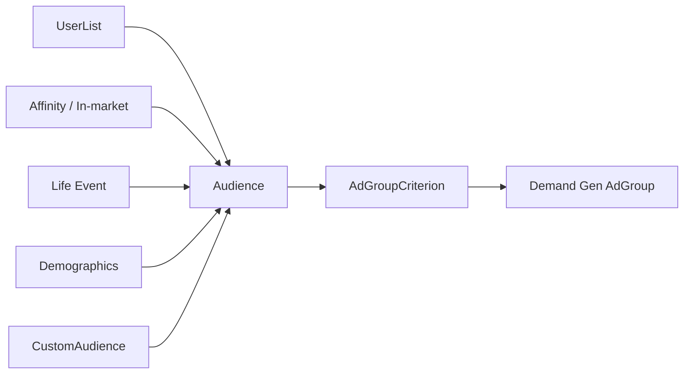
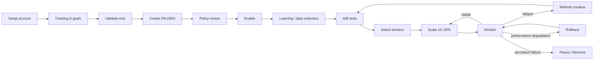

# Google Ads API pentru Demand Gen și YouTube In‑Stream: arhitectură, mutații și playbook operațional

## Rezumat executiv

La data de **13 august 2026**, versiunea majoră curentă a Google Ads API este **v25**, lansată la 22 iulie 2026. Pentru implementări noi, integrarea ar trebui construită pe v25 și urmărite release notes la fiecare versiune, deoarece Demand Gen și video au primit schimbări importante în v21–v25. citeturn24view3turn25view0

Cea mai importantă concluzie este că există două lucruri diferite pe care Google Ads UI le poate face să pară similare:

**Campaniile clasice Video, `AdvertisingChannelType=VIDEO`, inclusiv campaniile clasice In‑Stream, nu pot fi create sau administrate prin Google Ads API.** Documentația curentă spune explicit că API-ul poate doar să recupereze și să raporteze campanii Video existente și criteriile lor; nu poate crea campanii Video noi și nu poate actualiza campanii Video existente. Pentru management programatic, Google indică Google Ads Scripts sau Demand Gen. citeturn4view4

**Demand Gen este complet programabil prin Google Ads API și poate fi restrâns exact la inventarul YouTube In‑Stream** prin setarea la nivel de ad group:

```text
demand_gen_ad_group_settings
  .channel_controls
  .selected_channels
  .youtube_in_stream = true
```

în timp ce `youtube_in_feed`, `youtube_shorts`, `discover`, `gmail`, `display` și `maps` sunt dezactivate. Google documentează explicit controlul acestor canale la nivel de ad group. citeturn15search1turn25view2

Prin urmare, dacă cerința de business este „vreau să creez prin API o campanie care rulează numai YouTube In‑Stream”, arhitectura recomandată în 2026 este:

```text
DEMAND_GEN
  └─ AdGroup
       └─ selected_channels.youtube_in_stream = true
          toate celelalte canale = false
```

și **nu** încercarea de a crea un `VIDEO` campaign. citeturn16search0turn16search2

La nivel de mutații, resursele principale au următoarea suprafață API:

| Resursă | Create | Update / partial update | Remove | Rol principal |
|---|---:|---:|---:|---|
| `CampaignBudget` | Da | Da | Da | buget zilnic sau total |
| `Campaign` | Da | Da | Da | Demand Gen, bidding, status, dates |
| `AdGroup` | Da | Da | Da | audiență, targeting, channel controls |
| `AdGroupAd` | Da | Da | Da | creativ + status |
| `Asset` | Da | Da | **Nu** | imagini, video YouTube etc. |
| `Audience` | Da | Da | **Nu** | audiență compusă reutilizabilă |
| `UserList` | Da | Da | Da | remarketing / Customer Match / lookalike source |
| `CustomAudience` | Da | Da | Da | segment custom |
| `CampaignCriterion` | Da | Da | Da | geo, exclusions etc. |
| `AdGroupCriterion` | Da | Da | Da | audience, geo, language etc. |
| `CampaignConversionGoal` | **Nu** | Da | **Nu** | activarea/dezactivarea goal-urilor |
| `ConversionGoalCampaignConfig` | **Nu** | Da | **Nu** | configurația goal-urilor |
| Classic `VIDEO` campaign | **Nu** | **Nu** | **Nu prin modelul de management Video** | read/report only |

Operațiile C/U/R sunt definite direct de RPC-urile v25; `AssetOperation` și `AudienceOperation` sunt excepții importante deoarece nu expun un `remove`, iar cele două resurse de conversion-goal enumerate sunt update-only. citeturn22view0turn22view1turn22view2turn22view3turn21view0turn21view1turn21view2turn21view3turn26view0turn26view1turn26view2turn26view3

În Google Ads API, un „partial update” nu este o operație separată. Este un `update` însoțit de un **FieldMask/updateMask**, iar numai câmpurile enumerate în mask sunt modificate. Câmpurile trimise în payload dar absente din mask sunt ignorate. citeturn13search3turn13search7

Modelul recomandat de Google pentru crearea unei campanii Demand Gen este să creezi bugetul, campaign-ul, ad group-ul, audiențele, asset-urile și ad-ul într-un singur `GoogleAdsService.Mutate`, folosind resource names temporare cu ID-uri negative. Cu `partial_failure=false`, aceasta evită să rămână resurse „orfane” dacă o parte din structură nu trece validarea. citeturn15search10

## Arhitectură, capabilități și limitele In‑Stream

### Modelul de entități

```mermaid
flowchart TD
    MCC["Google Ads Manager / MCC"]
    CUST["Customer / Advertiser"]
    BUD["CampaignBudget<br/>non-shared"]
    CAMP["Campaign<br/>DEMAND_GEN"]
    GOAL["CampaignConversionGoal<br/>ConversionGoalCampaignConfig"]
    AG["AdGroup<br/>DemandGenAdGroupSettings"]
    CH["Channel Controls<br/>youtube_in_stream / in_feed / shorts<br/>discover / gmail / display / maps"]
    CRIT["AdGroupCriterion<br/>Audience / Geo / Language / exclusions"]
    AUD["Audience"]
    UL["UserList"]
    CA["CustomAudience"]
    AGA["AdGroupAd"]
    AD["Demand Gen Ad"]
    AS["Asset<br/>Image / YouTubeVideo / Logo"]
    CAR["DemandGen Carousel Card Asset"]

    MCC --> CUST
    CUST --> BUD
    BUD --> CAMP
    CUST --> AUD
    CUST --> UL
    CUST --> CA
    CAMP --> GOAL
    CAMP --> AG
    AG --> CH
    AG --> CRIT
    AUD --> CRIT
    UL --> AUD
    CA --> AUD
    AG --> AGA
    AGA --> AD
    AD --> AS
    AD --> CAR
```



Pentru Demand Gen, documentația descrie explicit secvența budget → campaign → ad group → audiences → assets/ads. Ad group-ul poate conține atât channel controls, cât și targeting de location/language și audience criteria. citeturn15search10turn16search4

### Demand Gen versus campania Video clasică

| Capabilitate | Demand Gen | Classic Video / In‑Stream `VIDEO` |
|---|---|---|
| Create campaign prin API | Da | Nu |
| Update campaign | Da | Nu |
| Pause/enable programatic | Da | Nu prin API-ul Video |
| Create/update ad groups | Da | Nu pentru campanii Video clasice |
| Create/update ads | Da | Nu pentru campanii Video clasice |
| Audience targeting | Da | doar citirea structurii existente pentru Video |
| YouTube In‑Stream only | Da, prin channel controls | campania poate exista, dar nu poate fi creată prin Ads API |
| Reporting | Da | Da |
| Alternative pentru Video management | Demand Gen | Google Ads Scripts |
| Recomandarea pentru un nou „API-only InStream campaign” | **Demand Gen + `youtube_in_stream=true`** | **Nu folosi `VIDEO`** |

Google precizează că Video campaigns din API sunt pentru fetching/reporting și arată inclusiv exemplul GAQL cu `campaign.advertising_channel_type = 'VIDEO'`; pentru management recomandă Scripts sau Demand Gen. citeturn4view4

O capcană importantă este că proto-ul generic `Campaign` v25 încă expune câmpuri de tip `VideoCampaignSettings`. Existența lor în schema generală **nu înseamnă că o campanie Video clasică a devenit mutabilă**; suportul efectiv este limitat de campaign type și de ghidul Video. citeturn23view2turn4view4

### Controlul exact al inventarului Demand Gen

Demand Gen suportă trei moduri de control:

| Configurație | Efect |
|---|---|
| `channel_strategy = ALL_CHANNELS` | toate canalele Demand Gen |
| `ALL_OWNED_AND_OPERATED_CHANNELS` | YouTube, Discover, Gmail, Maps; fără Display third-party |
| `selected_channels` | control granular pentru fiecare suprafață |

Câmpurile curente sunt `youtube_in_stream`, `youtube_in_feed`, `youtube_shorts`, `discover`, `gmail`, `display` și, adăugat în v24.2, `maps`. citeturn17search2turn25view2

Pentru In‑Stream-only:

```json
{
  "demandGenAdGroupSettings": {
    "channelControls": {
      "selectedChannels": {
        "youtubeInStream": true,
        "youtubeInFeed": false,
        "youtubeShorts": false,
        "discover": false,
        "gmail": false,
        "display": false,
        "maps": false
      }
    }
  }
}
```

Acesta este mecanismul documentat pentru controlul suprafețelor în Demand Gen. citeturn16search0

### Placements nu sunt același lucru cu channel controls

API-ul generic face o distincție importantă. Criteriul `Placement` este disponibil ca **excludere**, nu ca positive targeting: tabelul oficial marchează `Placement` cu positive ❌ și negative ✅ la campaign/ad group/customer. În schimb, `YouTube channel` și `YouTube video` au generic atât positive, cât și negative support, dar Google avertizează că disponibilitatea criteriilor trebuie să fie compatibilă cu tipul campaniei. citeturn15search2turn16search5

Pentru Demand Gen, ghidul dedicat garantează explicit audience targeting și location/language targeting la ad-group level, plus channel controls. Din acest motiv, nu aș proiecta o integrare Demand Gen presupunând că un anumit `youtube_channel` sau `youtube_video` criterion va fi acceptat doar pentru că apare în schema generică. Testează combinația prin `validateOnly=true` înainte de producție. citeturn16search2turn15search7

`DetailPlacementView` poate furniza raportare granulară pentru URL-uri, aplicații și YouTube videos unde s-au afișat reclame, dar documentația notează că acest view este concentrat în principal pe Google Display Network și nu trebuie tratat ca o enumerare perfectă a tuturor suprafețelor YouTube. citeturn17search10

### Changelog-ul relevant din ultimii ani

Cele mai importante schimbări pentru această integrare sunt:

| Versiune | Data | Impact |
|---|---|---|
| v21 | 6 aug. 2025 | `contains_eu_political_advertising` devine obligatoriu pentru campanii noi; lipsa produce `FieldError.REQUIRED`. citeturn25view1 |
| v21 | 2025 | apare `CampaignBudgetError.BUDGET_BELOW_DAILY_MINIMUM` pentru minimul Demand Gen. citeturn24view0 |
| v22 | 15 oct. 2025 | Demand Gen primește Target CPC / Max Clicks cu `Campaign.target_cpc`, override la `AdGroup.target_cpc_micros`; apar și asset automation pentru design/video. citeturn24view0turn24view3 |
| v23 | 28 ian. 2026 | `ad_sub_network_type` oferă segmentare Demand Gen YouTube In‑Stream/In‑Feed/Shorts; apar erori pentru total budget. citeturn24view0 |
| v23.1 | 25 feb. 2026 | apare `YouTubeVideoUploadService`, suportat în REST și Python. citeturn24view0 |
| v24 | 22 apr. 2026 | `DemandGenVideoResponsiveAdInfo.videos` și `logo_images` devin obligatorii la create/mutate; apare VTC optimization. citeturn25view0 |
| v24.1 | 13 mai 2026 | `classic_display_images` pentru Demand Gen Multi Asset. citeturn25view0 |
| v24.2 | 24 iun. 2026 | Maps devine canal selectabil; apare `COMPARE_CAMPAIGNS`; asset synthetic-content mutation este pregătită pentru v25. citeturn25view2 |
| v25 | 22 iul. 2026 | versiunea majoră curentă; adaugă raportare pentru subformatul In‑Stream non-skippable și metrics pentru likes/comments/shares YouTube Shorts. citeturn24view3turn25view2 |

## Matricea completă a mutațiilor

### Semantica create, update, partial update și remove

Pentru majoritatea serviciilor mutabile, operațiile sunt protobuf `oneof`: o operație conține **exact una** dintre `create`, `update` sau `remove`. La update, `update_mask` stabilește exact câmpurile modificate. citeturn22view0turn22view3

Exemplu conceptual:

```json
{
  "operations": [
    {
      "update": {
        "resourceName": "customers/1234567890/campaigns/987654321",
        "status": "PAUSED",
        "name": "numele trimis, dar ignorat dacă nu e în mask"
      },
      "updateMask": "status"
    }
  ]
}
```

Rezultatul este schimbarea exclusivă a `status`. `name` nu se modifică. Aceasta este forma corectă pentru update-uri idempotente și minim-invazive. citeturn13search3turn13search7

### Matricea operațiilor pe resurse

| Domeniu | Resource / service | Create | Update | Remove | Partial update | Observație |
|---|---|---:|---:|---:|---:|---|
| Budget | `CampaignBudgetService` | ✅ | ✅ | ✅ | ✅ | Demand Gen necesită budget non-shared. citeturn22view1turn15search10 |
| Campaign | `CampaignService` | ✅ | ✅ | ✅ | ✅ | `advertising_channel_type` este immutable. citeturn22view0turn23view2 |
| Ad group | `AdGroupService` | ✅ | ✅ | ✅ | ✅ | channel controls se află aici. citeturn22view2turn23view1 |
| Ad | `AdGroupAdService` | ✅ | ✅ | ✅ | ✅ | update subject to mutability of ad fields. citeturn22view3 |
| Asset | `AssetService` | ✅ | ✅ | ❌ | ✅ | nu există `remove` în `AssetOperation`. citeturn21view0 |
| Audience | `AudienceService` | ✅ | ✅ | ❌ | ✅ | nume unic; audience reutilizabilă. citeturn21view2turn16search4 |
| Audience segment | `UserListService` | ✅ | ✅ | ✅ | ✅ | include liste reutilizabile / lookalike sources. citeturn26view0 |
| Custom segment | `CustomAudienceService` | ✅ | ✅ | ✅ | ✅ | members pot fi administrate prin update. citeturn26view1 |
| Ad-group targeting | `AdGroupCriterionService` | ✅ | ✅ | ✅ | ✅ | criterion type însuși este frecvent immutable. citeturn21view1turn16search1 |
| Campaign targeting | `CampaignCriterionService` | ✅ | ✅ | ✅ | ✅ | geo/exclusions etc. citeturn21view3 |
| Conversion goal | `CampaignConversionGoalService` | ❌ | ✅ | ❌ | ✅ | update-only. citeturn26view2 |
| Goal config | `ConversionGoalCampaignConfigService` | ❌ | ✅ | ❌ | ✅ | update-only. citeturn26view3 |
| Reporting | `GoogleAdsService.Search/SearchStream` | — | — | — | — | read/query only. |
| Atomic multi-resource | `GoogleAdsService.Mutate` | ✅ | ✅ | ✅ | ✅ | poate combina tipuri de resurse într-o cerere. citeturn15search10 |

„Remove” este în general o operație logică Google Ads, nu echivalentul unei ștergeri fizice din istoricul contului; de exemplu, criteriile pot continua să apară în reporting cu status `REMOVED`. citeturn16search1

### Campaign și bidding

Pentru crearea Demand Gen:

```text
name                       required practic
advertising_channel_type   DEMAND_GEN, required, immutable
advertising_channel_sub_type
                           NU se setează pentru Demand Gen
campaign_budget            required
contains_eu_political_advertising
                           required pentru campanii noi
bidding strategy           una dintre strategiile Demand Gen suportate
status                     recomandat PAUSED la create
start/end datetime         optional, după modelul campaniei
```

`advertising_channel_type` este required la create și immutable ulterior; `advertising_channel_sub_type` este tot create-only/immutable și ghidul Demand Gen spune să nu fie setat. citeturn23view2turn16search2

Strategiile documentate pentru Demand Gen sunt **Maximize Clicks / Target CPC, Target CPA, Maximize Conversions și Target ROAS**. Target CPC a fost adăugat explicit în v22 și permite override la ad-group level prin `target_cpc_micros`. citeturn16search2turn24view3

Exemple de mutații utile:

| Schimbare | Resource | Update mask tipic |
|---|---|---|
| Pause / enable campaign | Campaign | `status` |
| Rename | Campaign | `name` |
| schimbare tCPA | Campaign | `target_cpa.target_cpa_micros` sau subtree conform client library |
| Max Clicks target CPC | Campaign | `target_cpc` |
| schimbare target ROAS | Campaign | bidding strategy relevant |
| VTC optimization | Campaign | `view_through_conversion_optimization_enabled` |
| start/end scheduling | Campaign | date-time field relevant |
| schimbare budget association | Campaign | `campaign_budget` |
| remove campaign | CampaignOperation | `remove: resource_name` |

VTC optimization a fost introdus în v24 pentru Demand Gen și App, cu default `false`. citeturn25view0

### Budget

Demand Gen cere un **non-shared CampaignBudget**. Pentru un buget zilnic folosești `amount_micros`; pentru lifetime/total budget folosești `total_amount_micros` cu period `CUSTOM_PERIOD`. Cele două valori sunt mutual exclusive. citeturn15search10turn23view0

Constrângerile importante sunt:

| Câmp | Regulă |
|---|---|
| `amount_micros` | average daily amount; doar pentru `DAILY` |
| `total_amount_micros` | total campaign cap; doar cu `CUSTOM_PERIOD` |
| `amount_micros` + `total_amount_micros` | nu pot fi setate împreună |
| `period` | immutable |
| `explicitly_shared` | Demand Gen trebuie creat non-shared |
| `name` | 1–255 UTF-8 bytes pentru explicit shared; non-shared poate deriva din campaign |
| `status` | output-only |
| `resource_name` | immutable |

Google precizează și că un non-shared budget poate deveni shared, dar un shared budget nu poate reveni la non-shared. citeturn23view0

Pentru Target CPA, ghidul Demand Gen recomandă un buget zilnic suficient de mare raportat la CPA-ul țintă; în practică trebuie de asemenea tratat `BUDGET_BELOW_DAILY_MINIMUM` și folosit minimum-ul furnizat în error details, nu o constantă hard-coded. citeturn3view0turn24view0

### Ad group, targeting și channel controls

La create, `AdGroup.name` este obligatoriu, trebuie să fie sub 255 de caractere UTF-8 full-width și nu poate include NULL, LF sau CR. `campaign` este immutable după creare. citeturn23view1

Pentru Demand Gen nu seta un ad-group type special; ghidul spune să creezi ad group-ul „without a type”. citeturn16search2

Câmpuri relevante:

```text
name
campaign
status
audience_setting.use_audience_grouped
optimized_targeting_enabled
exclude_demographic_expansion
target_cpa_micros
target_cpc_micros
demand_gen_ad_group_settings.channel_controls
```

`audience_setting` este immutable, deci dacă intenționezi să folosești `Audience` resource trebuie să setezi `use_audience_grouped=true` **la crearea ad group-ului**. Dacă nu o faci, adăugarea ulterioară a unui Audience `AdGroupCriterion` eșuează. citeturn23view1turn16search4

Pentru un criterion, `negative` este immutable. Ca să schimbi un target pozitiv în exclusion sau invers, trebuie să faci **remove + create**. Criterion-ul propriu-zis — audience, gender, age range etc. — este în general immutable, deci schimbarea identității targetului se modelează tot prin remove/recreate. citeturn16search1

### Audiences

`Audience` este un container reutilizabil care poate combina user lists, affinity/in-market segments, life events, detailed demographics, custom audiences, age, gender, household income și parental status. Pentru exclusion dimension este permis doar `UserListSegment`. Demand Gen targetează aceste Audience resources prin `AdGroupCriterion`. citeturn15search3turn16search4

Model:



Un `Audience` poate fi creat și actualizat, dar `AudienceOperation` nu are remove. `UserList` și `CustomAudience`, în schimb, expun create/update/remove. citeturn21view2turn26view0turn26view1

### Asset și creativ

Demand Gen v25 are trei tipuri creative principale documentate:

`DemandGenMultiAssetAdInfo`, `DemandGenCarouselAdInfo` și `DemandGenVideoResponsiveAdInfo`. `DemandGenMultiAssetAdInfo` suportă și `classic_display_images`. citeturn17search0turn25view0

Pentru product-feed campaigns există suplimentar `DemandGenProductAdInfo`. citeturn17search7turn17search11

#### Multi Asset

Constrângerile importante v25 sunt: citeturn10view0

| Asset | Min/max | Cerințe |
|---|---|---|
| Business name | required | max display width 25 |
| Headlines | 1–5 | max display width 30 |
| Descriptions | 1–5 | max display width 90 |
| Logo images | 1–5 | ≥128×128, 1:1 ±1% |
| Marketing images | până în limita combinată | ≥600×314, 1.91:1 ±1% |
| Square images | până în limita combinată | ≥300×300, 1:1 ±1% |
| Portrait images | până în limita combinată | ≥480×600, 4:5 ±1% |
| Tall portrait | până în limita combinată | ≥600×1067, 9:16 ±1% |
| Classic display images | max 20 | GIF/JPEG/PNG |
| toate image slots principale combinate | max 20 | marketing + square + portrait + tall |
| marketing vs square | condiție | trebuie să existe cel puțin una dintre categoriile cerute de format |

#### Carousel

Pentru `DemandGenCarouselAdInfo`: citeturn10view1

| Câmp | Regulă |
|---|---|
| `business_name` | required |
| `carousel_cards` | required, **2–10 cards** |
| `description` | required |
| `headline` | required |
| `logo_image` | required |
| logo | GIF/JPEG/PNG, minimum 128×128, 1:1 ±1% |

Carousel folosește asset-ul specializat `AdDemandGenCarouselCardAsset`. citeturn17search0

#### Video Responsive

În v24, `videos` și `logo_images` au trecut de la optional la **required pentru create și mutate**. `business_name` este required; video asset-urile trebuie să fie YouTube video assets; logo-ul trebuie să fie GIF/JPEG/PNG, minimum 128×128 și 1:1 ±1%; companion banners sunt în prezent limitate la maximum unul. citeturn25view0turn9view1

Un efect important este că un update creativ Video Responsive care trimite structura relevantă fără `videos` sau `logo_images` poate eșua chiar dacă integrarea funcționa pe o versiune anterioară v24. citeturn25view0

Pentru asset management generic, `AssetOperation` are create și update, dar **nu remove**. În loc să construiești un garbage collector care încearcă să șteargă assets nefolosite, tratează asset-urile ca entități persistente și elimină/înlocuiește legăturile sau ad-urile care le folosesc. citeturn21view0

## Rețeta end-to-end: de la cont gol la lansare

### Setup-ul contului și autentificării

Un „zero absolut” nu poate fi automatizat integral. Pentru a folosi API-ul ai nevoie mai întâi de un Google Ads **manager account**, deoarece developer token-ul se obține din API Center al unui manager account. Tokenul este un șir alfanumeric de 22 de caractere și trebuie transmis în fiecare request prin `developer-token`. citeturn19search0turn19search4

Fluxul recomandat:

| Etapă | Acțiune | Automatizabilă? |
|---|---|---|
| Manager account | creezi/alegi MCC | inițial UI |
| Developer token | aplici în API Center | inițial UI |
| Google Cloud project | creezi proiect + enable Google Ads API | Cloud/API setup |
| OAuth | service account sau user OAuth | da, după bootstrap |
| Client Google Ads account | existent sau `CustomerService.CreateCustomerClient` | da |
| Billing | self-service normal sau API pentru monthly invoicing | depinde |
| Conversion actions | configurezi tracking și goals | în mare parte API |
| Test account | recomandat înainte de producție | setup separat |
| Demand Gen objects | mutate API | da |

Google recomandă service account pentru aplicații care administrează conturi la care organizația are deja acces; pentru SaaS care administrează conturile altor utilizatori recomandă multi-user OAuth. OAuth 2.0 **nu înlocuiește** developer token-ul: sunt necesare ambele. citeturn19search1turn19search5

REST headers tipice:

```http
Authorization: Bearer ACCESS_TOKEN
developer-token: DEVELOPER_TOKEN
login-customer-id: MANAGER_CUSTOMER_ID
Content-Type: application/json
```

`login-customer-id` este necesar atunci când autentificarea operează printr-un manager asupra clientului; ID-urile se trimit fără cratime. citeturn19search5

Un client account poate fi creat prin `CustomerService.CreateCustomerClient`. Exemplul oficial setează `descriptive_name`, `currency_code`, `time_zone` și, opțional, URL tracking fields. citeturn19search2

Billing-ul prin Google Ads API are o limitare majoră: workflow-urile API de billing sunt destinate conturilor cu **monthly invoicing**. Nu presupune că poți configura prin BillingSetup API orice card/self-serve payments flow. citeturn19search7turn19search3

### Test înainte de producție

Test accounts nu servesc reclame și nu generează costuri și sunt separate de producție. Sunt ideale pentru testarea structurii mutațiilor, deși nu pot reproduce serving, policy review și learning-ul real al bidding-ului. citeturn19search0

Pentru fiecare request complex folosește două faze:

```text
1. validateOnly = true
2. dacă validarea trece:
   validateOnly = false
```

iar pentru crearea inițială Demand Gen preferă un `GoogleAdsService.Mutate` atomic, cu `partialFailure=false`. Recomandarea oficială de a crea entitățile interdependente într-un singur mutate evită orphans. citeturn15search10

### Structura minimă a unei campanii In‑Stream prin Demand Gen

Ordinea logică este:

```mermaid
flowchart LR
    A["Credentials + Customer"]
    B["Conversion tracking / Goals"]
    C["CampaignBudget<br/>non-shared"]
    D["Campaign<br/>DEMAND_GEN / PAUSED"]
    E["AdGroup<br/>Audience grouped"]
    F["Channel Controls<br/>InStream=true"]
    G["Audience + Criteria"]
    H["Video + Logo Assets"]
    I["DemandGenVideoResponsiveAd"]
    J["validateOnly"]
    K["Atomic Mutate"]
    L["Policy / Eligibility"]
    M["Enable"]
    N["Learning"]
    O["A/B Test"]
    P["Scale"]
    Q["Continuous Monitoring"]

    A --> B --> C --> D --> E --> F --> G --> H --> I --> J --> K --> L --> M --> N --> O --> P --> Q
```



#### Budget

Pentru daily budget:

```json
{
  "name": "DG InStream Budget",
  "amountMicros": "150000000",
  "deliveryMethod": "STANDARD",
  "explicitlyShared": false
}
```

`150000000` micros înseamnă 150 unități monetare din currency-ul contului. Google definește 1.000.000 micros = 1 unitate monetară. citeturn23view0

Pentru total budget:

```json
{
  "totalAmountMicros": "5000000000",
  "period": "CUSTOM_PERIOD",
  "explicitlyShared": false
}
```

Nu trimite simultan `amountMicros`. citeturn23view0

#### Campaign

```json
{
  "name": "DG | InStream | RO | Prospecting",
  "advertisingChannelType": "DEMAND_GEN",
  "status": "PAUSED",
  "campaignBudget": "customers/1234567890/campaignBudgets/111111",
  "containsEuPoliticalAdvertising": "DOES_NOT_CONTAIN_EU_POLITICAL_ADVERTISING",
  "targetCpa": {
    "targetCpaMicros": "10000000"
  }
}
```

Campania trebuie creată cu `DEMAND_GEN` și fără subtype. Self-declaration pentru EU political advertising trebuie furnizată; din v21 lipsa ei la create produce `FieldError.REQUIRED`. citeturn16search2turn25view1

#### Ad group

```json
{
  "name": "InStream | Broad audience",
  "campaign": "customers/1234567890/campaigns/222222",
  "status": "ENABLED",
  "audienceSetting": {
    "useAudienceGrouped": true
  },
  "demandGenAdGroupSettings": {
    "channelControls": {
      "selectedChannels": {
        "youtubeInStream": true,
        "youtubeInFeed": false,
        "youtubeShorts": false,
        "discover": false,
        "gmail": false,
        "display": false,
        "maps": false
      }
    }
  }
}
```

Această structură reflectă cele două decizii care trebuie făcute devreme: audience-grouped targeting și surface selection. citeturn16search4turn17search2

#### Audience criterion

Conceptual:

```json
{
  "adGroup": "customers/1234567890/adGroups/333333",
  "status": "ENABLED",
  "audience": {
    "audience": "customers/1234567890/audiences/444444"
  }
}
```

Demand Gen folosește `AdGroupCriterion` pentru targetarea unui Audience resource. citeturn16search4

#### Video-responsive ad

```json
{
  "adGroup": "customers/1234567890/adGroups/333333",
  "status": "ENABLED",
  "ad": {
    "name": "DG Video | Hook A | Offer A",
    "finalUrls": [
      "https://example.com/landing-page"
    ],
    "demandGenVideoResponsiveAd": {
      "businessName": {
        "text": "Brand Name"
      },
      "videos": [
        {
          "asset": "customers/1234567890/assets/555555"
        }
      ],
      "logoImages": [
        {
          "asset": "customers/1234567890/assets/666666"
        }
      ],
      "headlines": [
        {
          "text": "Headline A"
        }
      ],
      "longHeadlines": [
        {
          "text": "Long headline A"
        }
      ],
      "descriptions": [
        {
          "text": "Description A"
        }
      ]
    }
  }
}
```

`business_name`, `videos` și `logo_images` trebuie tratate ca obligatorii în implementarea curentă; `videos` și `logo_images` au devenit explicit required pentru create/mutate în v24. citeturn9view1turn25view0

### Checklist de launch

| Gate | Check | Criteriul de trecere |
|---|---|---|
| Auth | OAuth + developer token + manager routing | `listAccessibleCustomers` funcționează |
| Account | currency/timezone/core account | confirmate înainte de spend |
| Billing | payment activ | serving account eligibil |
| Tracking | conversion actions + primary goals | conversiile test se înregistrează |
| Budget | non-shared | `explicitly_shared=false` |
| Campaign | `DEMAND_GEN` | fără subtype |
| EU declaration | setată explicit | nu apare `FieldError.REQUIRED` |
| Bidding | strategia aleasă | compatibilă Demand Gen |
| Ad group | `use_audience_grouped=true` dacă folosești Audience | validat |
| Channels | exact suprafețele dorite | pentru InStream-only, numai `youtube_in_stream=true` |
| Audience | Audience criterion valid | segment IDs accesibile |
| Creative | toate required assets | logos/video/text complete |
| Asset quality | dimensions/MIME | conforme |
| Policy | nu există disapproval blocant | ad eligible |
| Validation | `validateOnly=true` | zero errors |
| Creation | atomic mutate | toate resource names primite |
| Pre-flight | campaign PAUSED | verificare GAQL |
| Launch | set campaign ENABLED | după toate controalele |

## Testare, scalare și optimizare

### Principiul de bază pentru A/B testing

Google Ads optimizează dinamic delivery-ul, deci un „A/B test” făcut doar prin două ads în același ad group nu înseamnă neapărat trafic 50/50. Pentru teste cauzale, separă variabila testată și controlează restul structurii.

În v24.2 Google a introdus `COMPARE_CAMPAIGNS`, descris pentru experimente care compară mai multe campanii de același tip sau tipuri diferite. Totuși, release note-ul nu promite că orice configurație Demand Gen este compatibilă; tratează `validateOnly` ca gate înainte de a construi automatizarea pe această funcție. `YOUTUBE_CUSTOM` există pentru experimente Video existente, dar nu schimbă restricția că noile campanii clasice Video nu pot fi construite prin Ads API. citeturn25view2turn25view0turn4view4

Pentru o integrare robustă, un test controlat poate fi modelat:

```text
Campaign A
  AdGroup A
    Audience X
    InStream-only
    Creative A

Campaign B
  AdGroup B
    Audience X
    InStream-only
    Creative B
```

cu budget, geo, bidding și conversion goal identice.

### Matrice de test recomandată

Pragurile de mai jos sunt **heuristici operaționale**, nu limite impuse de Google Ads API.

| Test | Ce păstrezi fix | Ce schimbi | Gate recomandat |
|---|---|---|---|
| Hook video | audience, bid, landing page, offer | primele secunde/video | minimum suficient spend/conversions pentru stabilitate |
| Offer | creative skeleton, audience | ofertă/CTA | judecă după CPA/ROAS, nu CTR singur |
| Audience | creative, bid, LP | Audience resource | comparable spend |
| InStream vs Shorts | creative adaptat | channel controls | separă ad groups/campaigns |
| tCPA | creative/audience | target CPA | evită multiple schimbări simultan |
| Landing page | campaign/ad | final URL | tracking consistent |
| Creative format | audience | video vs multi-asset | evaluează conversions + cost |
| VTC optimization | restul setup-ului | VTC flag | monitorizează mixul de conversii |

### Metrici de monitorizat

Pentru Demand Gen poți raporta la campaign, ad și asset level prin `GoogleAdsService.SearchStream`. Pentru clicks, documentația Demand Gen cere filtrarea relevantă pe `click_type=CROSS_NETWORK`. citeturn17search3

Setul minim de observabilitate ar trebui să includă:

| Familie | Metrici / dimensiuni |
|---|---|
| Delivery | impressions, cost, interactions |
| Traffic | clicks, CTR, CPC |
| Conversion | conversions, conversion value, CPA, ROAS |
| Creative/video | video views, view-related metrics, watch time unde sunt selectable |
| Surface | `ad_network_type`, `ad_sub_network_type` |
| Format | `ad_format_type`, `ad_sub_format_type` |
| Ad | ad ID/type/status/policy |
| Asset | asset ID/type + asset-level metrics |
| Audience | criterion/audience + segmented performance unde disponibil |
| Geo/device | location/device |
| Frequency | unique-user frequency metrics disponibile |
| Shorts | YouTube comments, likes, shares |

`ad_sub_network_type` a fost introdus pentru Demand Gen YouTube și permite separarea In‑Stream, In‑Feed și Shorts, fiind selectat împreună cu network dimension-ul aferent. citeturn24view0

În v25, `ad_sub_format_type` poate identifica duratele de In‑Stream non-skippable — standard, până la aproximativ 30 secunde și până la aproximativ 60 secunde — și trebuie selectat împreună cu `ad_format_type`. V25 a adăugat și `youtube_comments`, `youtube_likes` și `youtube_shares` pentru Shorts. citeturn25view2

Exemplu GAQL pentru campanii Demand Gen:

```sql
SELECT
  campaign.id,
  campaign.name,
  campaign.status,
  campaign.bidding_strategy_type,
  metrics.impressions,
  metrics.clicks,
  metrics.cost_micros,
  metrics.conversions,
  metrics.conversions_value
FROM campaign
WHERE campaign.advertising_channel_type = DEMAND_GEN
  AND segments.date DURING LAST_7_DAYS
```

Campaign/ad/asset reporting pentru cele trei tipuri Demand Gen este suportat oficial. „Demand Gen video ad (legacy)” din frontend este o excepție și nu este returnat/suportat de API. citeturn17search3

### Praguri operaționale pentru decizii

Un playbook prudent, pe care l-aș implementa în automation rules:

| Semnal | Acțiune sugerată |
|---|---|
| < ~10 conversions | nu lua decizii agresive pe CPA/ROAS; sample prea mic pentru automation |
| ~20–30+ conversions pe variantă și perioadă relevantă | începe comparația serioasă între variante |
| CPA ≤ target × 1.10 și volum stabil | candidat la scale |
| CPA > target × 1.25 după volum suficient | investighează/limitează spend |
| ROAS ≥ target × 1.10 | candidat la scale |
| ROAS < target × 0.80 după sample suficient | reducere/refresh/test |
| CTR/view metric scade >20% vs perioada precedentă, concomitent cu CPA în creștere | semnal de creative fatigue |
| cost ≥ ~2–3× target CPA fără conversion | review/pause la nivelul relevant |
| spend constrâns de budget + CPA/ROAS bun | crește budget gradual |
| CPA crește puternic după scale | rollback la ultima configurație stabilă |

Acestea trebuie parametrizate după conversion lag, marja economică și volumul business-ului. O achiziție de 500 EUR necesită alte praguri decât un lead de 5 EUR.

### Scaling playbook

În loc de salturi masive de buget, un controller conservator poate folosi:

```text
CPA <= 0.9 × target și volum stabil:
    +20% până la +30% budget

0.9 × target < CPA <= 1.1 × target:
    +10% până la +20%

1.1 × target < CPA <= 1.25 × target:
    hold

CPA > 1.25 × target:
    reducere / creative-audience diagnosis
```

Un interval operațional de 48–72 ore între modificări semnificative este mai sigur decât modificarea continuă dacă volumul nu este foarte mare. Acest prag este o regulă de operare, nu o limitare API.

Ordinea recomandată de scale este:

```text
creative winners
      ↓
budget incremental
      ↓
audience expansion / optimized targeting experiment
      ↓
additional channels
      ↓
geo expansion
      ↓
bidding target relaxation
```

Această ordine permite să identifici mai ușor cauza schimbării de performanță decât dacă modifici simultan budget, audience, channels și tCPA.

### Lifecycle-ul complet



## Erori, validare, quota și failure modes

### Erori care merită tratate explicit

| Error / failure | Cauză probabilă | Fix |
|---|---|---|
| `FieldError.REQUIRED` | lipsește `contains_eu_political_advertising` la create campaign | setează declarația explicit; obligatorie pentru campanii noi din v21. citeturn25view1 |
| `CriterionError.MISSING_EU_POLITICAL_ADVERTISING_SELF_DECLARATION` | modifici location/proximity criteria înainte de declarație | update campaign declaration, apoi criterion mutate. citeturn25view1 |
| `CampaignBudgetError.BUDGET_BELOW_DAILY_MINIMUM` | budget Demand Gen sub minimul valid | citește `budgetDailyMinimumErrorDetails.minimum_budget_amount_micros` și ridică budget. citeturn24view0 |
| `CampaignError.END_DATE_TIME_REQUIRED_FOR_TOTAL_BUDGET` | total budget fără end date/time necesar | setează end date/time. citeturn24view0 |
| `CampaignError.DURATION_TOO_LONG_FOR_TOTAL_BUDGET` | duration incompatibilă cu total budget | scurtează perioada sau schimbă modelul de budget. citeturn24view0 |
| `AudienceError.AUDIENCE_SEGMENT_NOT_FOUND` | segment ID inexistent/inaccesibil | validează segmentele înainte de Audience mutate. citeturn15search3 |
| `UserListError.DUPLICATE_LOOKALIKE` | două lookalike lists identice | reutilizează lista existentă / modifică seed. citeturn25view0 |
| `CriterionError.CANNOT_TARGET_LANGUAGE` | language criterion nepermis | verifică language constant/campaign compatibility. citeturn25view0 |
| `CriterionError.CANNOT_EXCLUDE_ALL_TARGETS` | exclusions elimină întreaga dimensiune demografică | lasă cel puțin o categorie eligibilă. citeturn25view0 |
| `AdGroupAdError.AD_SHARING_NOT_ALLOWED` | încearcă reutilizarea aceluiași ad în mai multe ad groups | creează ad separat per ad group. citeturn24view0 |
| `FieldMaskError.FIELD_HAS_SUBFIELDS` | update mask folosește un message parent incorect | indică leaf fields/subfields corect. citeturn13search7 |
| `MutateError.RESOURCE_NOT_FOUND` | resource name/ID greșit sau client scope greșit | verifică customer ID, temp IDs și dependency ordering. citeturn25view0 |
| `RESOURCE_EXHAUSTED` | rate/quota limit | exponential backoff + jitter; reduce concurrency. citeturn4view6turn4view7 |

Pentru classic `VIDEO`, prevenția corectă este să nu trimiți mutate requests. Google declară campaign type-ul read/report-only; integrarea ar trebui să facă un capability check local și să routeze crearea In‑Stream către Demand Gen. citeturn4view4

### Failure mode: FieldMask incorect

Să presupunem că vrei numai pause:

```json
{
  "update": {
    "resourceName": "customers/123/campaigns/456",
    "status": "PAUSED"
  },
  "updateMask": "status"
}
```

Nu folosi un mask generic asupra unui întreg message dacă documentația cere leaf fields. Google Ads poate răspunde cu `FieldMaskError.FIELD_HAS_SUBFIELDS`. Pentru clearing, câmpul ce trebuie golit trebuie în continuare inclus explicit în mask. citeturn13search7

### Failure mode: audience mode setat prea târziu

Greșit:

```text
create AdGroup fără use_audience_grouped
↓
încerci ulterior să adaugi Audience criterion
↓
request fails
```

Corect:

```text
create AdGroup
  audience_setting.use_audience_grouped = true
↓
create Audience
↓
create AdGroupCriterion(audience=...)
```

Google documentează explicit această dependență. citeturn16search4

### Failure mode: channel controls presupuse la campaign level

Channel controls Demand Gen sunt **ad-group settings**, nu campaign settings. Dacă arhitectura internă tratează surface selection drept atribut de campanie, mapper-ul trebuie să îl materializeze pe fiecare ad group. citeturn17search2

### Failure mode: video assets incomplete după upgrade la v24+

O integrare construită înainte de aprilie 2026 poate trimite un mutate de Demand Gen video fără a retrimite `videos`/`logo_images` conform noilor cerințe și începe brusc să eșueze după migrare de versiune. V24 le-a făcut required la create/mutate. citeturn25view0

De aceea, version upgrade testing trebuie să conțină cel puțin:

```text
create ad
update ad
pause ad
replace video asset
replace logo asset
change final URL
change bidding
change channel control
audience mutation
budget mutation
remove criterion/ad/adgroup/campaign
```

cu `validateOnly` pe versiunea nouă înainte de rollout.

### Rate limits și quota

Google diferențiază access levels pentru developer token. În documentația curentă, limitele zilnice de bază includ aproximativ: **Explorer 2.880 operații/zi în production și 15.000 pe test**, iar **Basic 15.000/zi**; Standard are acces zilnic nelimitat pentru majoritatea serviciilor, dar rămâne supus system rate limits și limitelor specifice serviciilor. citeturn4view6turn4view7

Limite importante:

| Limită | Valoare / comportament |
|---|---|
| Mutate operations per request | max **10.000** |
| Batch `AddBatchJobOperations` | max **10.000** per request din v22 |
| gRPC response | max **64 MB** |
| Daily API operations | depinde de access level |
| Runtime system rate limits | se aplică și cu Standard |
| Rate-limit response | tipic `RESOURCE_EXHAUSTED` |
| Retry | exponential backoff + jitter |

Limita de 10.000 mutate operations este suficientă pentru lansarea atomică a unei campanii obișnuite, dar nu este o invitație de a pune mii de campanii într-un singur request. Pentru bulk management mare, BatchJob este arhitectural mai potrivit. citeturn4view6turn24view0

În producție aș implementa:

```text
per-customer concurrency limiter
+ developer-token global limiter
+ retry exponential backoff
+ jitter
+ idempotency ledger intern
+ request-id logging
+ partialFailure parsing
+ dead-letter queue pentru mutații nerecuperabile
```

`request-id` este returnat în headers și este esențial pentru debugging/support. citeturn19search5

## Exemple REST, Python și JavaScript

### Cerere REST atomică

Forma conceptuală pentru `GoogleAdsService.Mutate` v25:

```http
POST https://googleads.googleapis.com/v25/customers/1234567890/googleAds:mutate

Authorization: Bearer ACCESS_TOKEN
developer-token: DEVELOPER_TOKEN
login-customer-id: 9999999999
Content-Type: application/json
```

```json
{
  "mutateOperations": [
    {
      "campaignBudgetOperation": {
        "create": {
          "resourceName": "customers/1234567890/campaignBudgets/-1",
          "amountMicros": "150000000",
          "explicitlyShared": false
        }
      }
    },
    {
      "campaignOperation": {
        "create": {
          "resourceName": "customers/1234567890/campaigns/-2",
          "name": "DG | InStream | Launch",
          "advertisingChannelType": "DEMAND_GEN",
          "status": "PAUSED",
          "campaignBudget": "customers/1234567890/campaignBudgets/-1",
          "containsEuPoliticalAdvertising":
            "DOES_NOT_CONTAIN_EU_POLITICAL_ADVERTISING",
          "targetCpa": {
            "targetCpaMicros": "10000000"
          }
        }
      }
    },
    {
      "adGroupOperation": {
        "create": {
          "resourceName": "customers/1234567890/adGroups/-3",
          "campaign": "customers/1234567890/campaigns/-2",
          "name": "YouTube InStream",
          "status": "ENABLED",
          "audienceSetting": {
            "useAudienceGrouped": true
          },
          "demandGenAdGroupSettings": {
            "channelControls": {
              "selectedChannels": {
                "youtubeInStream": true,
                "youtubeInFeed": false,
                "youtubeShorts": false,
                "discover": false,
                "gmail": false,
                "display": false,
                "maps": false
              }
            }
          }
        }
      }
    }
  ],
  "partialFailure": false,
  "validateOnly": true,
  "responseContentType": "MUTABLE_RESOURCE"
}
```

Google recomandă explicit negative temporary IDs și un singur `GoogleAdsService.Mutate` pentru entitățile interdependente Demand Gen. citeturn15search10

După validare:

```json
{
  "partialFailure": false,
  "validateOnly": false
}
```

Un răspuns reușit conține resource names rezultate pentru operațiile mutate; păstrează aceste resource names în baza de date internă și nu te baza exclusiv pe numele human-readable.

### Partial update REST

Creșterea budgetului:

```http
POST https://googleads.googleapis.com/v25/customers/1234567890/campaignBudgets:mutate
```

```json
{
  "operations": [
    {
      "update": {
        "resourceName":
          "customers/1234567890/campaignBudgets/111111111",
        "amountMicros": "180000000"
      },
      "updateMask": "amount_micros"
    }
  ],
  "partialFailure": false,
  "validateOnly": false
}
```

`CampaignBudgetOperation` suportă update și FieldMask. citeturn22view1

Pause campaign:

```json
{
  "operations": [
    {
      "update": {
        "resourceName":
          "customers/1234567890/campaigns/222222222",
        "status": "PAUSED"
      },
      "updateMask": "status"
    }
  ]
}
```

Remove ad:

```json
{
  "operations": [
    {
      "remove":
        "customers/1234567890/adGroupAds/333333333~444444444"
    }
  ]
}
```

Formatele resource name sunt definite explicit de `CampaignOperation` și `AdGroupAdOperation`. citeturn22view0turn22view3

### Python cu client library oficial

Google menține oficial client libraries pentru Python, Java, .NET, PHP, Ruby și Perl. citeturn14search3

Exemplul următor creează nucleul Demand Gen InStream într-un singur mutate; credentials sunt presupuse configurate deja prin mecanismul oficial `google-ads` client.

```python
from google.ads.googleads.client import GoogleAdsClient
from google.ads.googleads.errors import GoogleAdsException


def create_demand_gen_instream(
    client: GoogleAdsClient,
    customer_id: str,
    daily_budget_micros: int,
    target_cpa_micros: int,
) -> None:
    google_ads_service = client.get_service("GoogleAdsService")

    customer = f"customers/{customer_id}"
    budget_rn = f"{customer}/campaignBudgets/-1"
    campaign_rn = f"{customer}/campaigns/-2"
    ad_group_rn = f"{customer}/adGroups/-3"

    operations = []

    # Budget
    budget_op = client.get_type("MutateOperation")
    budget = budget_op.campaign_budget_operation.create
    budget.resource_name = budget_rn
    budget.amount_micros = daily_budget_micros
    budget.explicitly_shared = False
    operations.append(budget_op)

    # Campaign
    campaign_op = client.get_type("MutateOperation")
    campaign = campaign_op.campaign_operation.create
    campaign.resource_name = campaign_rn
    campaign.name = "DG | API | YouTube InStream"
    campaign.advertising_channel_type = (
        client.enums.AdvertisingChannelTypeEnum.DEMAND_GEN
    )
    campaign.status = client.enums.CampaignStatusEnum.PAUSED
    campaign.campaign_budget = budget_rn

    campaign.contains_eu_political_advertising = (
        client.enums.EuPoliticalAdvertisingStatusEnum
        .DOES_NOT_CONTAIN_EU_POLITICAL_ADVERTISING
    )

    campaign.target_cpa.target_cpa_micros = target_cpa_micros
    operations.append(campaign_op)

    # Ad group
    ad_group_op = client.get_type("MutateOperation")
    ad_group = ad_group_op.ad_group_operation.create
    ad_group.resource_name = ad_group_rn
    ad_group.campaign = campaign_rn
    ad_group.name = "YouTube InStream only"
    ad_group.status = client.enums.AdGroupStatusEnum.ENABLED

    # Required if you intend to attach Audience resources.
    ad_group.audience_setting.use_audience_grouped = True

    channels = (
        ad_group.demand_gen_ad_group_settings
        .channel_controls
        .selected_channels
    )
    channels.youtube_in_stream = True
    channels.youtube_in_feed = False
    channels.youtube_shorts = False
    channels.discover = False
    channels.gmail = False
    channels.display = False
    channels.maps = False

    operations.append(ad_group_op)

    # First run can use validate_only=True.
    try:
        response = google_ads_service.mutate(
            customer_id=customer_id,
            mutate_operations=operations,
            partial_failure=False,
            validate_only=False,
        )

        for result in response.mutate_operation_responses:
            print(result)

    except GoogleAdsException as exc:
        print(f"Request ID: {exc.request_id}")
        for error in exc.failure.errors:
            print(error)
        raise
```

Structura urmează direct exemplul oficial Demand Gen: budget non-shared, `DEMAND_GEN`, `PAUSED`, tCPA, ad group fără type și channel controls. citeturn15search10turn16search2

Pentru un update de budget, clientul Python poate genera automat FieldMask:

```python
from google.api_core.protobuf_helpers import field_mask

def update_budget(
    client: GoogleAdsClient,
    customer_id: str,
    budget_id: str,
    new_amount_micros: int,
):
    service = client.get_service("CampaignBudgetService")
    operation = client.get_type("CampaignBudgetOperation")

    budget = operation.update
    budget.resource_name = (
        f"customers/{customer_id}/campaignBudgets/{budget_id}"
    )
    budget.amount_micros = new_amount_micros

    operation.update_mask.CopyFrom(
        field_mask(None, budget._pb)
    )

    return service.mutate_campaign_budgets(
        customer_id=customer_id,
        operations=[operation],
    )
```

Field masks sunt mecanismul oficial pentru updates parțiale. citeturn13search7

### JavaScript prin REST

Google nu listează Node.js printre client libraries oficial menținute de Google Ads API; pentru JavaScript, o alegere robustă este să folosești direct REST, cu un OAuth access token obținut prin infrastructura Google OAuth. citeturn14search3turn19search5

```javascript
const API_VERSION = "v25";

/**
 * Calls GoogleAdsService.Mutate over REST.
 *
 * accessToken should be obtained through your OAuth flow.
 */
async function googleAdsMutate({
  customerId,
  loginCustomerId,
  developerToken,
  accessToken,
  operations,
  validateOnly = false,
}) {
  const url =
    `https://googleads.googleapis.com/${API_VERSION}` +
    `/customers/${customerId}/googleAds:mutate`;

  const response = await fetch(url, {
    method: "POST",
    headers: {
      Authorization: `Bearer ${accessToken}`,
      "developer-token": developerToken,
      "login-customer-id": loginCustomerId,
      "Content-Type": "application/json",
    },
    body: JSON.stringify({
      mutateOperations: operations,
      partialFailure: false,
      validateOnly,
      responseContentType: "MUTABLE_RESOURCE",
    }),
  });

  const requestId = response.headers.get("request-id");
  const payload = await response.json();

  if (!response.ok) {
    const error = new Error(
      `Google Ads API failed (${response.status}); request-id=${requestId}`
    );
    error.details = payload;
    throw error;
  }

  return {
    requestId,
    payload,
  };
}
```

Crearea structurii InStream:

```javascript
const customerId = "1234567890";
const base = `customers/${customerId}`;

const operations = [
  {
    campaignBudgetOperation: {
      create: {
        resourceName: `${base}/campaignBudgets/-1`,
        amountMicros: "150000000",
        explicitlyShared: false,
      },
    },
  },
  {
    campaignOperation: {
      create: {
        resourceName: `${base}/campaigns/-2`,
        name: "DG | JS | InStream",
        advertisingChannelType: "DEMAND_GEN",
        status: "PAUSED",
        campaignBudget: `${base}/campaignBudgets/-1`,
        containsEuPoliticalAdvertising:
          "DOES_NOT_CONTAIN_EU_POLITICAL_ADVERTISING",
        targetCpa: {
          targetCpaMicros: "10000000",
        },
      },
    },
  },
  {
    adGroupOperation: {
      create: {
        resourceName: `${base}/adGroups/-3`,
        campaign: `${base}/campaigns/-2`,
        name: "InStream only",
        status: "ENABLED",
        audienceSetting: {
          useAudienceGrouped: true,
        },
        demandGenAdGroupSettings: {
          channelControls: {
            selectedChannels: {
              youtubeInStream: true,
              youtubeInFeed: false,
              youtubeShorts: false,
              discover: false,
              gmail: false,
              display: false,
              maps: false,
            },
          },
        },
      },
    },
  },
];

// Dry run first.
const validation = await googleAdsMutate({
  customerId,
  loginCustomerId: process.env.GOOGLE_ADS_MANAGER_ID,
  developerToken: process.env.GOOGLE_ADS_DEVELOPER_TOKEN,
  accessToken: process.env.GOOGLE_ACCESS_TOKEN,
  operations,
  validateOnly: true,
});

console.log("Validation:", validation);

// Only after validation succeeds:
const created = await googleAdsMutate({
  customerId,
  loginCustomerId: process.env.GOOGLE_ADS_MANAGER_ID,
  developerToken: process.env.GOOGLE_ADS_DEVELOPER_TOKEN,
  accessToken: process.env.GOOGLE_ACCESS_TOKEN,
  operations,
  validateOnly: false,
});

console.log("Created:", created.payload);
```

Autorizarea REST cere OAuth bearer token plus developer token, iar manager-routed requests folosesc `login-customer-id`. citeturn19search5

## Blueprint-ul operațional recomandat

O integrare de producție ar trebui să se comporte mai degrabă ca un deployment system decât ca un script care „postează niște ads”.

Structura internă utilă este:

```text
Desired Campaign Spec
        │
        ▼
Schema validation
        │
        ▼
Capability validation
  ├─ DEMAND_GEN → writable
  └─ VIDEO      → read-only / reject mutation
        │
        ▼
Google Ads validateOnly
        │
        ▼
Diff against current resources
        │
        ├─ create
        ├─ partial update
        ├─ remove + recreate
        └─ no-op
        │
        ▼
Atomic / Batch mutate
        │
        ▼
Persist resource names + request-id
        │
        ▼
GAQL verification
        │
        ▼
Policy/serving gate
        │
        ▼
Enable
        │
        ▼
Metrics → optimizer → new desired state
```

Pentru fiecare obiect ar trebui păstrat intern cel puțin:

```text
customer_id
resource_name
external/business key
Google resource ID
desired state hash
last applied state
API version
last mutation request-id
last successful mutation timestamp
policy status
serving status
experiment ID / cohort
creative version
```

Astfel poți face update-uri idempotente, rollback și reconciliation fără să reconstruiești relațiile doar din numele entităților.

Checklist-ul final pentru o lansare Demand Gen In‑Stream complet programatică este:

| Fază | Done când… |
|---|---|
| Bootstrap | developer token + OAuth + manager routing funcționează. citeturn19search0turn19search5 |
| Account | client customer, currency, timezone și billing sunt corecte. citeturn19search2turn19search7 |
| Measurement | conversion tracking și campaign goals sunt validate |
| Budget | non-shared și peste minimum-ul acceptat Demand Gen. citeturn23view0turn24view0 |
| Campaign | `DEMAND_GEN`, no subtype, EU declaration setată. citeturn16search2turn25view1 |
| Bidding | una dintre strategiile Demand Gen suportate. citeturn16search2turn24view3 |
| Audience | `use_audience_grouped=true` înainte de criterion create. citeturn16search4 |
| Surface | numai `youtube_in_stream=true` pentru InStream-only. citeturn17search2 |
| Creative | video + logo + business name și restul assets conforme v25. citeturn9view1turn25view0 |
| Validation | întregul graph trece `validateOnly` |
| Creation | `GoogleAdsService.Mutate`, preferabil atomic. citeturn15search10 |
| Pre-launch | campaign rămâne PAUSED până la verificarea resources/policies |
| Launch | ENABLED numai după gates |
| Monitoring | GAQL campaign/ad/asset + surface metrics. citeturn17search3turn24view0 |
| Test | o singură variabilă majoră schimbată per experiment |
| Scale | budget incremental, apoi audience/channel expansion |
| Failure handling | request-id, retries, quotas și dead-letter handling. citeturn19search5turn4view6turn4view7 |
| Versioning | regresion tests la fiecare upgrade API, în special creatives/video |

**Concluzia arhitecturală:** în 2026, nu există o „rețetă Google Ads API pentru crearea unei campanii clasice Video In‑Stream”, deoarece acel model este read/report-only. Există însă o soluție API-native și complet mutabilă: **Demand Gen → AdGroup channel controls → YouTube In‑Stream only → DemandGenVideoResponsiveAd**. Aceasta oferă create/update/remove la campaign, budget, ad group și ad level, partial updates prin FieldMask, audience/criterion management, creative asset management și reporting granular pe suprafața YouTube, fiind modelul care ar trebui folosit pentru o platformă de automatizare nouă. citeturn4view4turn17search2turn22view0turn22view2turn22view3