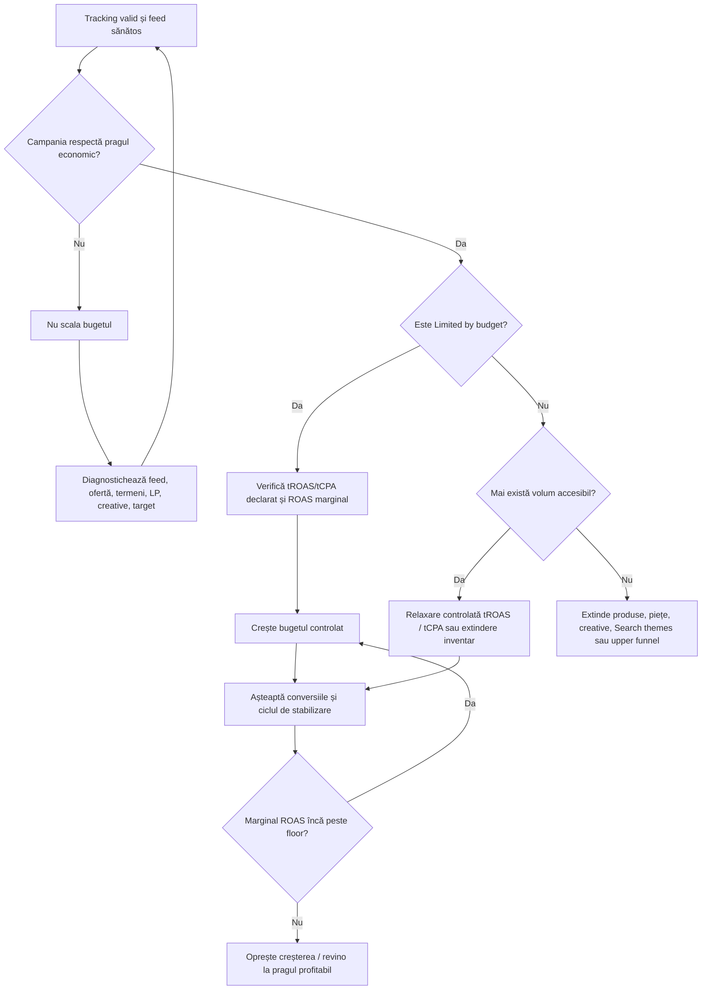
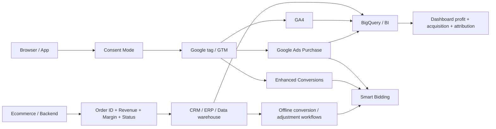
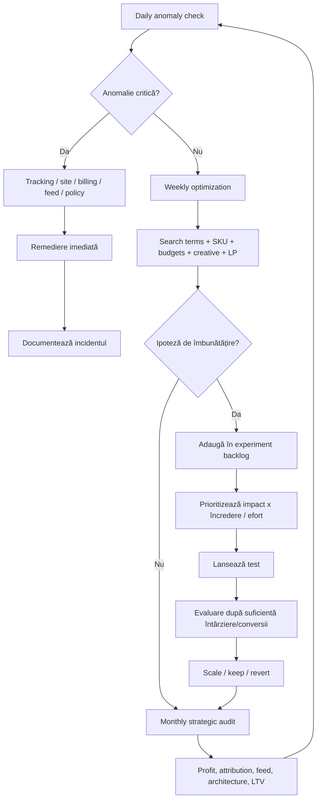

# Google Ads pentru ecommerce în România — cercetare și manual operațional

## Rezumat executiv

Pentru un magazin ecommerce, Google Ads funcționează cel mai bine nu ca o colecție de campanii izolate, ci ca un **sistem de achiziție bazat pe valoare**, în care Merchant Center furnizează date corecte despre produse, Search captează cererea explicită, Performance Max extinde distribuția și automatizează achiziția cross-channel, iar Display/Video acoperă segmentele de remarketing, prospectare și creare de cerere. Performance Max poate utiliza inventarul Search, Shopping, YouTube, Display, Discover, Gmail și Maps și este conceput să completeze campaniile Search bazate pe cuvinte-cheie, nu să le elimine. citeturn10search0turn0search0turn19search0

Pentru ecommerce, optimizarea ar trebui făcută în primul rând după **valoarea economică a comenzii**, nu doar după numărul de tranzacții. Google recomandă raportarea valorilor tranzacționale atunci când conversiile au valori diferite și folosirea Maximize conversion value sau Target ROAS atunci când obiectivul real este valoarea/revenitul, în timp ce Maximize conversions și Target CPA sunt mai potrivite atunci când conversiile au aproximativ aceeași valoare economică. citeturn17search5turn16search9turn5search4

La data acestui raport există și o schimbare operațională imediată: **începând cu 17 august 2026**, Google modifică comportamentul strategiilor cu target pentru campaniile „Limited by budget”, astfel încât acestea să urmărească mai consecvent tCPA/tROAS-ul declarat chiar și când se schimbă bugetul. Google recomandă revizuirea acestor campanii înainte de 17 august și a pus la dispoziție Bid Target Adjustment Tool. Pentru un magazin care scalează agresiv, aceasta este o schimbare importantă: un tROAS setat „relaxat”, dar pe care campania îl depășea istoric, nu mai trebuie tratat ca o simplă limită teoretică. citeturn17search0turn17search2turn16search0

În Merchant Center, **calitatea feedului este parte din sistemul de bidding**, nu doar o sarcină tehnică. Titlurile, identificatorii de produs, imaginile, prețul, disponibilitatea, variantele și datele de livrare determină eligibilitatea și contextul pe care Google îl are pentru potrivirea produselor. Google a actualizat specificația Merchant Center în aprilie 2026 și, între altele, a introdus atributul opțional `video_link`; videoclipurile trimise prin acesta au devenit eligibile pentru servire din 30 iunie 2026. citeturn16search2turn2search0turn2search2

Măsurarea ar trebui construită cu **Google Ads purchase conversion cu valoare dinamică + Enhanced Conversions + GA4 + Consent Mode**, nu doar prin importarea evenimentului GA4 în Google Ads. Din aprilie 2026, Enhanced Conversions pentru web și leads utilizează o setare unificată și poate primi date prin taguri, Data Manager și API; Google precizează totodată că obiectivele importate din Google Analytics nu sunt compatibile cu Enhanced Conversions, deci pentru implementarea acestora este indicată o acțiune de conversie Google Ads nativă. citeturn16search4turn16search7turn3search6

Pentru România, contextul economic favorizează o administrare mai atentă a profitabilității decât a volumului brut. Analiza MerchantPro pentru primul semestru din 2026 indică pentru magazinele analizate o creștere de aproximativ 4% a valorii vânzărilor, în timp ce numărul comenzilor a rămas aproximativ constant, cu diferențe foarte mari între verticale. MerchantPro estimează piața ecommerce locală la peste €8,1 miliarde în 2025 și aproximativ €8,5 miliarde în 2026. Acestea sunt estimări și date din ecosistemul MerchantPro, nu recensăminte exhaustive ale întregii piețe. citeturn11search4turn11search2

În același timp, datele de consum publicate de MerchantPro pentru 2026 sugerează sensibilitate ridicată la preț și promoții în România: raportul indică utilizare importantă a cupoanelor, tendința de reducere a cumpărăturilor neesențiale și disponibilitate ridicată de a schimba marca pentru un preț mai bun. Implicația pentru Google Ads este că mesajele despre preț, livrare, retur, promoție și încredere trebuie privite ca elemente de CRO și creative, nu doar ca informații logistice. citeturn11search8

**Principiul operațional central al acestui raport** este:

> **Măsurare corectă → feed corect → ofertă și pagină competitivă → structură suficient de consolidată pentru învățare → bidding după valoare → scalare pe baza ROAS-ului marginal și profitului, nu a ROAS-ului mediu.**

Această succesiune este o sinteză operațională, nu o regulă impusă de Google; este compatibilă însă cu recomandările Google privind consolidarea Performance Max, folosirea valorilor tranzacționale, Smart Bidding, semnalele first-party și calitatea feedului. citeturn5search4turn1search0turn1search2

**Date de business nespecificate de utilizator și care trebuie completate înaintea unei implementări reale:**

| Variabilă | Status | De ce contează |
|---|---|---|
| Platformă ecommerce | **Nespecificată** | Determină implementarea feedului, taggingului și Enhanced Conversions |
| Buget Google Ads lunar | **Nespecificat** | Determină câtă segmentare poate susține contul |
| AOV | **Nespecificat** | Necesar pentru CPA și scenarii de venit |
| Marjă brută / contribuție | **Nespecificată** | Necesară pentru break-even ROAS |
| Costuri de livrare/subvenție | **Nespecificate** | Modifică profitabilitatea reală |
| Rată retur/anulare/COD refuzat | **Nespecificată** | Critică în ecommerce românesc pentru valoarea reală a comenzilor |
| Număr SKU | **Nespecificat** | Determină complexitatea feedului și campaniilor |
| Categorii și distribuția veniturilor | **Nespecificate** | Determină custom labels și segmentarea |
| Piețe țintă | **Nespecificate** | Raportul presupune prioritar România |
| Pondere clienți noi/recurenți | **Nespecificată** | Importantă pentru CAC, LTV și New Customer Acquisition |
| CRM / ERP / PIM | **Nespecificate** | Determină posibilitatea de a importa marje, anulări și conversii offline |
| Obiectiv de profit | **Nespecificat** | Fără el, un „ROAS bun” nu poate fi definit economic |

Consecința este că exemplele de buget, tROAS și CPA de mai jos sunt **ilustrative, nu recomandări financiare personalizate**.

## Arhitectura contului și structura campaniilor

Un cont ecommerce matur ar trebui structurat după **diferențe reale de economie și control**, nu după fiecare categorie sau fiecare idee de marketing. Google recomandă consolidarea Performance Max acolo unde obiectivele și constrângerile sunt similare, deoarece volumele fragmentate reduc cantitatea de date disponibilă fiecărei campanii. Separarea devine justificată atunci când există bugete, ROAS-uri, piețe, marje, sezonalități, obiective de achiziție a clienților sau unități de business realmente diferite. citeturn5search4turn10search0

### Rolul fiecărui tip de campanie

| Tip | Rol recomandat în ecommerce | Puncte forte | Limite / riscuri | Bidding uzual |
|---|---|---|---|---|
| **Search** | Captarea cererii explicite; brand, categorii și interogări comerciale cu intenție mare | Control asupra termenilor, mesajelor și landing page-urilor; exact match identic cu interogarea are prioritate față de PMax | Poate deveni hiperfragmentat; broad fără măsurare bună poate consuma buget pe intenție slabă | Maximize conversions, tCPA, Maximize conversion value, tROAS; Manual CPC pentru cazuri speciale citeturn17search5turn1search1 |
| **Standard Shopping** | Control granular asupra produselor; benchmark/experiment versus PMax; cazuri în care se dorește mai multă transparență | Feed-based, product groups, control mai explicit; Manual CPC este disponibil | Mai multă administrare; nu oferă automat distribuția cross-channel PMax | Manual CPC sau bidding automat compatibil citeturn0search1 |
| **Performance Max** | Motor principal de scalare retail când trackingul și feedul sunt solide | Search + Shopping + YouTube + Display + Discover + Gmail + Maps; Smart Bidding, feed și asset-uri într-o singură campanie | Mai puțin control decât Search; poate amplifica problemele de tracking, feed sau URL | Maximize conversion value/tROAS sau Maximize conversions/tCPA, în funcție de obiectiv citeturn10search0turn17search5 |
| **Display** | Remarketing, prospectare vizuală, promoții, produse dinamice | Responsive Display Ads combină automat imagini, logo-uri, texte și video; poate folosi feed dinamic | Intent mai slab decât Search/Shopping; ușor de optimizat după „conversii” de calitate mică dacă obiectivele sunt greșite | Maximize conversions/tCPA sau alte strategii compatibile citeturn0search3turn0search7 |
| **Video / YouTube** | Creare de cerere, remarketing, demonstrații de produs, educare, upper/mid funnel și, cu suficiente date, performance | Inventar YouTube, Google TV și video partners; multiple formate și obiective | Creativul este determinant; last-click subevaluează frecvent rolul upper-funnel | Strategia depinde de subtype și obiectiv: tCPA, CPM și alte variante citeturn5search2turn5search6 |

O extensie relevantă a stackului actual este **Demand Gen**, în special pentru magazinele cu material vizual bun. Campaniile Demand Gen pot utiliza feedul Merchant Center și pot livra experiențe de produs pe YouTube, Discover și Gmail. Google recomandă combinarea asset-urilor image+product și video+product pentru acoperire mai mare; feedul poate fi filtrat și prin custom labels. citeturn5search3turn5search7

**Arhitectură recomandată pentru un magazin ecommerce mediu**, ca punct de pornire:

```text
Google Ads Account
│
├── Search | Brand
│   └── marcă + variante marcă + produse/marcă
│
├── Search | Non-brand | High intent
│   ├── categorie comercială A
│   ├── categorie comercială B
│   └── termeni cu intenție ridicată
│
├── Performance Max | Core Retail
│   ├── Asset group: familie produs A
│   ├── Asset group: familie produs B
│   └── Asset group: familie produs C
│
├── Performance Max | segment economic separat
│   └── doar dacă marja / targetul / bugetul justifică separarea
│
├── Standard Shopping | Control / Experiment
│   └── numai unde există o ipoteză clară
│
├── Display | Remarketing / promoție
│
└── Video / Demand Gen | Prospecting + Remarketing
```

Aceasta este o **arhitectură operațională recomandată**, nu o cerință Google. În conturile mici, chiar și această structură poate fi prea fragmentată; în conturile mari, poate fi necesară separarea pe țări, business units, inventar sau obiective economice.

**Search de brand merită de regulă separat** pentru vizibilitate și control, însă rezultatele sale nu trebuie confundate cu incrementalitatea. O persoană care caută deja numele magazinului are o intenție diferită de un prospect care caută generic un produs. De aceea, raportarea trebuie să afișeze brand și non-brand separat, chiar dacă managementul urmărește și totalul. În ceea ce privește conflictul cu PMax, Google aplică reguli de prioritizare: un keyword exact identic cu interogarea din Search este prioritar față de Performance Max; search themes din PMax au o prioritate similară cu phrase/broad atunci când sunt identice cu interogarea. citeturn19search0turn19search1

Performance Max dispune în prezent de **brand exclusions și negative keywords la nivel de campanie**, iar negative keywords pentru PMax se aplică inventarului Search și Shopping. Există și negative keywords la nivel de cont. Aceste controale sunt utile pentru brand safety, termeni complet irelevanți și, în anumite arhitecturi, pentru separarea intenției; nu ar trebui folosite însă pentru a transforma PMax într-o pseudo-campanie Search ultra-restrictivă. citeturn15search4

Search themes sunt **semnale, nu keywords tradiționale**. Google permite până la 50 de teme pe asset group și recomandă informație incrementală pe care sistemul nu o poate deduce ușor din feed, site sau assets. Ele sunt deosebit de utile la produse noi, nișe, termeni sezonieri sau jargon specific categoriei. citeturn19search1turn19search7

**Structura unui Search modern** ar trebui să favorizeze coerența semantică și suficient volum per ad group. Responsive Search Ads pot include până la 15 headlines și patru descriptions, iar Google combină automat variantele. Separarea în zeci de ad groups cu câteva impresii fiecare trebuie evitată dacă nu există motive reale privind landing page-ul, mesajul sau economia. citeturn0search2turn0search6

Un model de naming care facilitează reportingul:

```text
[Țară]_[Tip]_[Brand/NonBrand]_[Categorie/Segment]_[Obiectiv]_[Bidding]

RO_SEARCH_BRAND_ALL_SALES_TROAS
RO_SEARCH_NB_RUNNING_SALES_TROAS
RO_PMAX_CORE_HIGHMARGIN_SALES_TROAS
RO_SHOP_STD_CLEARANCE_SALES_MANUAL
RO_VIDEO_PROSPECTING_NEW_CUSTOMERS_TCPA
```

Namingul nu îmbunătățește algoritmul, dar reduce costul operațional al auditului, automatizării și raportării.

**Audience strategy** ar trebui tratată diferit în funcție de tipul campaniei. În Performance Max, audience signals sunt sugestii pentru sistem, nu limite rigide de targetare; PMax poate căuta în afara lor dacă estimează probabilitate bună de conversie. Google permite first-party lists, Customer Match, website/app visitors, custom segments, interese, in-market, demografice și alte semnale. citeturn1search2

Prioritatea recomandată pentru date este:

| Prioritate | Semnal | Exemplu ecommerce | Utilizare |
|---|---|---|---|
| Foarte mare | **Customer Match** | cumpărători, VIP, cumpărători categorie X, high-LTV | PMax signals, Search observation/targeting unde este permis, YouTube/Display |
| Foarte mare | **Website first-party** | view product, cart, checkout, purchase | remarketing și semnale PMax |
| Mare | **Search themes / custom intent** | „pantofi alergare carbon”, competitori, probleme rezolvate de produs | descoperire și prospectare |
| Medie | **In-market** | segmente Google apropiate de categorie | semnal de extindere |
| Medie | **Demografice** | doar dacă există relație clară cu produsul | analiză și eventual control |
| Mică | **Affinity foarte general** | „shopping enthusiasts” | upper-funnel, nu ca bază exclusivă a performance marketingului |

Customer Match folosește date first-party și poate fi utilizat pe Search, Shopping, Gmail, YouTube și Display, în funcție de eligibilitate și setări. În 2026, documentația Google recomandă Data Manager API pentru noile workflow-uri programatice Customer Match. citeturn1search3

Pentru retenție, segmentele utile nu sunt „toți clienții”, ci categorii cu logică economică: **cumpărători în ultimele 30/90/365 zile, clienți cu AOV ridicat, clienți cu a doua comandă, abonați inactivi, cumpărători pe categorie și clienți cu LTV ridicat**. Acest lucru permite fie excluderea clienților existenți din prospectare, fie acordarea unei valori diferite clientului nou, în funcție de obiectiv. Google oferă în Performance Max un obiectiv dedicat pentru achiziția de clienți noi și permite atribuirea unei valori suplimentare acestora. citeturn19search2

## Licitare, bugete și scalare

În 2026, nomenclatura Smart Bidding a fost simplificată: Google a început din iunie să afișeze „Target CPA” în loc de „Maximize conversions with a Target CPA” și „Target ROAS” în loc de „Maximize conversion value with a Target ROAS”. Comportamentul de bază nu s-a schimbat din această redenumire. citeturn16search9turn17search5

### Comparația strategiilor de bidding

| Strategie | Când are sens | Avantaj | Principalul risc | Recomandare ecommerce |
|---|---|---|---|---|
| **Manual CPC** | Campanii de control, test foarte specific, volum insuficient sau nevoia explicită de control | Control direct al max CPC | Nu folosește integral optimizarea auction-time Smart Bidding | Nu este strategia implicită pentru un ecommerce matur cu tracking bun citeturn1search1 |
| **Maximize conversions** | Toate conversiile au valoare apropiată și obiectivul este volum maxim în buget | Simplu; sistemul încearcă să maximizeze numărul conversiilor | Poate prefera comenzi mici dacă purchase values variază | Utilă temporar sau la business cu valoare uniformă citeturn17search5 |
| **Target CPA** | Valoarea economică per conversie este relativ uniformă și există un CPA sustenabil | Controlează costul mediu dorit | Ignoră diferența dintre o comandă de 100 lei și una de 1.000 lei dacă ambele sunt o conversie | Mai bun pentru lead-gen decât retail cu AOV variabil; poate fi valid pentru categorii omogene citeturn17search5 |
| **Maximize conversion value** | Se dorește valoare maximă în buget, fără o limită strictă de ROAS | Prioritizează conversii cu valoare mai mare | Poate cheltui întregul buget chiar la eficiență sub pragul de profit | Bună pentru explorare/scalare când bugetul este plafonul real citeturn16search9 |
| **Target ROAS** | Există revenue/value tracking corect și un prag economic explicit | Optimizează valoarea cu obiectiv de eficiență | Target prea mare poate sufoca volumul; target prea mic poate distruge marja | De regulă strategia principală pentru ecommerce matur citeturn16search0turn17search5 |

Target ROAS lucrează la nivel de licitație și folosește valorile de conversie raportate; obiectivul său este un ROAS mediu apropiat de țintă. Google oferă exemplul conceptual al unui tROAS de 500% pentru 5 unități de venit la fiecare unitate monetară cheltuită. citeturn16search0

Problema este că **revenue ROAS nu este profit ROAS**.

Formula de bază:

\[
ROAS = \frac{Venit\ atribuit}{Cost\ publicitar}
\]

Dar decizia de scalare ar trebui să pornească de la marja de contribuție:

\[
M = \frac{Venit - COGS - taxe\ variabile - procesare - livrare\ subvenționată - retururi - alte\ costuri\ variabile}{Venit}
\]

Dacă `M` este marja disponibilă înainte de advertising:

\[
Break-even\ ROAS = \frac{1}{M}
\]

**Exemplu ilustrativ:**

Comandă medie = 300 RON  
COGS = 180 RON  
procesare + fulfilment + rezervă retur = 30 RON  
contribuție pre-ads = 90 RON = 30%

Prin urmare:

\[
Break-even\ ROAS = 1 / 0,30 = 3,33x = 333\%
\]

Dacă businessul cere și 10% contribuție după advertising, doar 20% din venit poate fi cheltuit pe achiziție:

\[
ROAS_{țintă} = 1 / 0,20 = 5x = 500\%
\]

CPA maxim la AOV de 300 RON devine:

\[
CPA_{max}=300/5=60\ RON
\]

Aceste valori sunt exemple calculate, nu benchmarkuri Google.

Un avantaj major al ecommerce este că se poate merge mai departe și transmite în sistem **valoare economică mai apropiată de profit**, nu doar cifra de afaceri, dacă infrastructura permite. Google permite optimizarea Maximize conversion value către valori definite de advertiser, inclusiv valori reprezentative pentru marjă, iar value rules pot diferenția valoarea anumitor tipuri de conversii. citeturn16search9

### Bugetarea de la obiectiv înapoi

În loc de „avem 30.000 RON, să vedem ce se întâmplă”, metoda corectă este:

\[
Buget = Număr\ incremental\ de\ comenzi\ dorit \times CPA_{acceptabil}
\]

Pentru 500 de comenzi incrementale/lună la CPA maxim de 60 RON:

\[
500 \times 60 = 30.000\ RON/lună
\]

Buget mediu zilnic ilustrativ:

\[
30.000 / 30,4 \approx 987\ RON/zi
\]

Pentru 1.000 de comenzi la același CPA:

\[
1.000 \times 60 = 60.000\ RON/lună
\]

Dar această extrapolare este validă **numai dacă există suficientă cerere și ROAS-ul marginal rămâne peste pragul economic**. Dublarea bugetului rareori înseamnă dublarea volumului la același CPA/ROAS; pe măsură ce sistemul intră în licitații marginale, eficiența se poate deteriora.

Un cadru inițial de alocare pentru un cont care are deja tracking și feed funcțional poate fi:

| Componentă | Interval operațional orientativ | Rațiune |
|---|---:|---|
| PMax / Shopping commerce core | 50–70% | Acoperă cererea de produs și permite scalare feed-based |
| Search brand + non-brand | 20–35% | Capturează cererea explicită și păstrează controlul termenilor |
| Video / Display / Demand Gen / experimente | 10–20% | Creează cerere, remarketing și testează noi surse |

**Aceste procente sunt un framework de planificare, nu benchmarkuri sau recomandări oficiale Google.** Pentru un magazin nou fără brand search, Search/PMax pot avea alte proporții; pentru o marcă matură cu material video excelent, Demand Gen/YouTube pot justifica o pondere mai mare.

Mai bună decât o distribuție fixă este o **ierarhie a capitalului**:

1. finanțează mai întâi campaniile care au tracking valid și cerere disponibilă;
2. adaugă buget până când ROAS-ul marginal se apropie de pragul de business;
3. păstrează un buget explicit pentru experimentare;
4. mută capitalul între categorii în funcție de marjă, stoc, sezonalitate și incrementalitate.

### Cadrul de scalare

Google recomandă perioade suficiente de evaluare pentru Smart Bidding și avertizează împotriva modificărilor repetitive în perioada de learning. Pentru evaluarea Smart Bidding, documentația Google sugerează perioade mai lungi și volume suficiente de conversii; în anumite ghiduri este menționat orientativ un volum de aproximativ 30 de conversii și mai mult pentru unele strategii bazate pe valoare. Acestea nu trebuie interpretate drept praguri universale de eligibilitate pentru toate campaniile. citeturn1search0turn3search3



Acesta este un workflow recomandat, construit pe principiile Smart Bidding, nu un flux oficial Google. O schimbare deosebit de relevantă este cea din **17 august 2026**: pentru campaniile cu tCPA/tROAS limitate de buget, Google spune că sistemul va urmări mai consecvent targetul declarat atunci când bugetul se schimbă. Înainte de scalare, advertiserii trebuie să verifice dacă targetul introdus în interfață reprezintă într-adevăr economia pe care o doresc. citeturn17search0turn17search3

### Tactici de scalare comparate

| Tactică | Când | Efect probabil | Risc | Control recomandat |
|---|---|---|---|---|
| Creștere buget | Campanie profitabilă și budget-limited | Mai mult volum | Intrare în trafic marginal | Urmărește marginal ROAS, nu doar media |
| Scădere tROAS | Campania nu e budget-limited și există cerere suplimentară | Mai multă participare în licitații | Profitabilitate mai mică | Relaxare graduală și un singur factor major schimbat odată |
| Creștere tCPA | Echivalent pentru obiective CPA | Mai mult volum | CPA real poate urca | Compară cu CPA economic |
| Extindere SKU | Bestsellerii sunt plafonați | Mai mult inventar și long-tail | Produse cu marjă mică pot dilua performanța | Custom labels și profit data |
| Extindere Search | PMax nu acoperă suficient termeni strategici | Control suplimentar | Duplicare și fragmentare | Separă doar intenții cu valoare reală |
| Creative noi | PMax/Video au acoperire limitată sau fatigue | Mai mult inventar și context | Cost de producție | Testează concepte, nu doar mici variații |
| Extindere geografică | Economics și logistică validate | Piață nouă | CPA, retur, transport diferite | Campanie și P&L separat unde economia diferă |
| New customer bidding | LTV justifică un CAC mai mare | Creștere achiziție | Supraestimarea LTV | Folosește customer lists și LTV conservator |
| Promoție | Elasticitate bună la preț | CVR mai mare | Marjă deteriorată | Calculează profitul, nu ROAS-ul izolat |

O regulă des întâlnită în industrie este scalarea bugetelor în pași relativ mici, de exemplu 10–20%, însă **Google nu prescrie universal un procent fix**. Mai robust este să dimensionezi schimbarea după conversia zilnică, întârzierea de conversie și impactul acceptabil asupra P&L. De exemplu, o campanie cu sute de tranzacții/zi tolerează experimente mai rapide decât una cu două comenzi pe săptămână.

Pentru promoții scurte și excepționale, Smart Bidding oferă **seasonality adjustments**. Google le recomandă pentru schimbări majore și anticipate ale ratei de conversie, în special evenimente de aproximativ una până la șapte zile; pentru sezonalitatea normală, sistemul este proiectat să se adapteze fără o ajustare manuală. citeturn7search11turn17search5

## Feed, pagini de destinație și creative

Feedul Merchant Center este una dintre cele mai importante surse de semnal ale unui ecommerce. Google precizează că date incorecte sau neconforme pot produce limitarea eligibilității sau respingerea produselor și că informații precum title, identifiers, brand, price și availability trebuie trimise în format corect. citeturn2search0turn16search11

### SOP pentru optimizarea feedului

| Pas | Acțiune | Standard operațional |
|---|---|---|
| Inventariere | Exportă toate SKU-urile și atributele disponibile | ID stabil, title, description, link, image, price, availability, brand, GTIN/MPN unde există, categorie, variant attributes |
| Identificatori | Verifică GTIN/brand/MPN | Nu inventa GTIN-uri; folosește identificatorii producătorului conform specificației Google citeturn2search0 |
| Titluri | Rescrie după intenția cumpărătorului | Pune cele mai distinctive informații mai devreme: brand, tip produs, atribut cheie, model, dimensiune/culoare unde este relevant citeturn2search2 |
| Descrieri | Include caracteristicile care diferențiază produsul | Evită text inutil și informație contradictorie cu pagina |
| Imagini | Folosește imagine principală clară, de rezoluție bună | Fără placeholder și fără overlay promoțional neconform; adaugă imagini suplimentare relevante citeturn2search2 |
| Preț/stoc | Sincronizare cât mai rapidă cu site-ul | Feed, structured data și landing page trebuie să concorde citeturn2search3turn15search2 |
| Variante | Culoare, mărime, material etc. | URL-ul trebuie să conducă la varianta corectă sau să o preselecteze conform datelor trimise citeturn15search6 |
| Shipping/returns | Completează informația disponibilă | Reduce incertitudinea și poate permite adnotări eligibile în Shopping/PMax citeturn5search4 |
| Custom labels | Transformă datele economice în dimensiuni de campaign management | Marjă, bestseller, sezon, sell-through, stoc, price band |
| QA | Merchant Center „Needs attention” | Zero erori critice; warnings prioritizate după impact |
| Automatizare | API/feed manager/platform integration | Elimină editările manuale repetitive și diferențele de preț/stoc |

Google permite **cinci custom labels**, `custom_label_0` până la `custom_label_4`. Acestea nu sunt afișate consumatorului; sunt folosite pentru organizare, reporting și segmentarea produselor în Shopping, Performance Max și alte campanii compatibile. citeturn2search1turn2search5

O schemă recomandată:

| Custom label | Exemplu de valori | Utilitate |
|---|---|---|
| `custom_label_0` | `margin_high`, `margin_mid`, `margin_low` | Bidding după economie |
| `custom_label_1` | `bestseller`, `normal`, `long_tail` | Prioritate comercială |
| `custom_label_2` | `evergreen`, `summer`, `back_to_school`, `christmas` | Sezonalitate |
| `custom_label_3` | `stock_high`, `stock_mid`, `stock_low` | Evitarea bugetului pe produse aproape epuizate |
| `custom_label_4` | `price_0_100`, `100_300`, `300_plus` | AOV/price-band analysis |

**Marja este de obicei cel mai valoros custom label pe care un feed standard nu îl are.** Google vede revenue-ul trimis ca valoare de conversie, dar nu cunoaște implicit COGS-ul, costul logistic sau rata de retur a fiecărui SKU. Introducerea acestora în feed/reporting permite managerului să nu declare „câștigător” un produs cu ROAS 600% și marjă 10% în fața unuia cu ROAS 450% și marjă 50%.

Merchant Center poate utiliza **automatic item updates** pentru a reconcilia anumite diferențe de preț, disponibilitate și condiție folosind date structurate de pe site. Aceasta este o plasă de siguranță, nu un substitut pentru un feed sincronizat corect. citeturn2search3

În 2026, Google a introdus și `video_link` ca atribut opțional al produsului. Videoclipurile au devenit eligibile pentru serving și verificări de policy/quality începând cu 30 iunie 2026. Pentru magazine cu produse demonstrabile — fashion, beauty, home, sport, consumer electronics — aceasta adaugă un motiv suplimentar pentru producerea de video la nivel de SKU/categorie. citeturn16search2

Pentru integrare programatică, **Merchant API este succesorul Content API for Shopping** și a ajuns la versiune general disponibilă în 2025; platformele ecommerce sau partenerii care gestionează integrarea pot abstra acest proces. citeturn14search3turn14search4turn14search5

### Landing page și CRO

Pentru Shopping, pagina trebuie să prezinte clar produsul corespunzător feedului, inclusiv elementele esențiale precum produs, imagine, preț, disponibilitate și posibilitatea de cumpărare; prețul și varianta trebuie să fie consistente cu datele trimise către Merchant Center. Google avertizează că nepotrivirile reduc calitatea experienței și pot cauza probleme de eligibilitate. citeturn15search2turn15search6

Google Ads recomandă monitorizarea Landing Pages Report și subliniază importanța vitezei pe mobil; documentația sa citează cercetări retail conform cărora o întârziere de o secundă pe mobil poate avea un impact de până la 20% asupra conversiilor mobile. Această cifră trebuie tratată ca un exemplu Google, nu ca o elasticitate universală pentru orice magazin. citeturn15search1

Core Web Vitals oferă un cadru tehnic complementar. Google definește în prezent ca prag „good” LCP ≤ 2,5 secunde și INP ≤ 200 ms, măsurate la percentila 75; CLS evaluează stabilitatea vizuală. Acestea sunt metrici de experiență, nu o garanție directă de creștere a ROAS. citeturn15search3turn15search7

Pagina de produs ar trebui să răspundă, într-o singură privire mobilă, la cinci întrebări:

**Ce este produsul? Cât costă? De ce este mai bun/relevant? Când îl primesc? Pot avea încredere în magazin?**

Un template de product detail page orientat către trafic Google Ads:

```text
[Imagine/video produs clar]
[Nume produs + varianta exactă]
[Rating / review count, dacă este autentic]
[Preț + promoție clară]
[Livrare estimată + prag transport gratuit]
[CTA: Adaugă în coș / Cumpără]
[Stoc]

Beneficii principale
Dovezi / review-uri
Specificații
Compararea variantelor
Livrare și retur
FAQ
Cross-sell / bundle
```

Pentru România, afișarea transparentă a costului și termenului de livrare, politicii de retur, metodelor de plată, datelor societății și elementelor de încredere este deosebit de importantă într-un context în care studiile MerchantPro indică sensibilitate la preț și diferențe de încredere între comercianți. citeturn11search8

Benchmarkurile de CRO trebuie folosite doar diagnostic. Littledata, pe un set istoric de aproximativ 2.800 magazine Shopify, raporta o rată medie ecommerce de circa 1,4%, cu peste 3,2% pentru top 20% dintre magazinele analizate. Aceste date sunt utile ca orientare, dar provin dintr-un eșantion Shopify mai vechi și nu reprezintă piața românească. citeturn9search0turn9search4

Unbounce raporta pentru ecommerce o mediană de aproximativ 4,2% pentru conversiile pe landing pages analizate și aproximativ 5,7% pentru traficul ecommerce provenit din Google paid search. „Conversion” nu înseamnă obligatoriu aceeași definiție ca o achiziție finală în toate conturile incluse, deci comparația cu purchase CVR din Google Ads trebuie făcută cu prudență. citeturn9search1

### Strategia de creative

În Responsive Search Ads pot fi furnizate până la 15 headlines și patru descriptions, din care Google testează combinații. Un set bun nu constă în 15 sinonime, ci în unghiuri distincte: produs, diferențiator, ofertă, încredere, logistică, urgență și social proof. citeturn0search2turn0search6

Exemplu de matrice pentru Search:

| Unghi | Exemplu conceptual |
|---|---|
| Produs | „Pantofi alergare pentru maraton” |
| USP | „Retur gratuit 30 zile” |
| Preț | „Reduceri de până la X%” |
| Logistică | „Livrare rapidă din România” |
| Încredere | „Mii de clienți verificați” |
| Selecție | „Peste X modele în stoc” |
| Urgență | „Oferta se încheie duminică” |
| CTA | „Comandă online” |

Valorile `X` sunt **nespecificate** și trebuie înlocuite numai cu afirmații reale și verificabile.

Responsive Display Ads pot utiliza multiple imagini, logo-uri, headlines, descriptions și video, iar Google generează combinații adaptate inventarului disponibil. Documentația curentă permite până la 15 imagini de marketing și mai multe variante text, inclusiv până la cinci headlines și cinci descriptions în configurațiile relevante. citeturn0search3turn0search7

Pentru Video, frameworkul creativ recomandat este:

```text
0–3 secunde     Hook / problemă / rezultat vizual
3–8 secunde     Produsul și utilizarea
8–15 secunde    Beneficiu + diferențiator
15–25 secunde   Dovadă / demonstrație / testimonial
Final           Ofertă + branding + CTA
```

Nu există un singur format universal. Google Video campaigns suportă formate precum skippable in-stream, in-feed, non-skippable și bumper, iar obiectivul și biddingul disponibil variază în funcție de subtype. citeturn5search2turn5search6

Pentru PMax, Google recomandă asset-uri text, imagine și video diverse și de bună calitate; dacă advertiserul nu furnizează anumite materiale, Google poate crea automat assets în unele situații. Pentru control de brand și calitate, este preferabil ca magazinul să furnizeze materialele importante în mod proactiv. citeturn10search3turn5search4

Final URL expansion este activ implicit în Performance Max și îi permite sistemului să trimită utilizatorul către o pagină pe care o consideră mai relevantă decât URL-ul introdus inițial. Pentru ecommerce, trebuie revizuite URL exclusions astfel încât trafic comercial să nu ajungă la pagini de suport, termeni și condiții, joburi, bloguri nerelevante sau pagini interne fără intenție comercială. citeturn5search1turn5search9

## Măsurare, atribuire și testare

Un setup de marketing nu este mai bun decât semnalul pe care îl optimizează. Dacă Google Ads primește dublu purchase events, valori brute incorecte, taxe inconsistente sau micro-conversii ca acțiuni primary, Smart Bidding va optimiza foarte eficient către un obiectiv greșit.

Google definește **primary conversion actions** drept acțiunile incluse în coloana Conversions și utilizate pentru bidding atunci când goal-ul respectiv este activ; secondary actions sunt în principal pentru observație. citeturn19search5turn19search8

Pentru ecommerce, configurația recomandată este:

| Eveniment | Rol recomandat |
|---|---|
| Purchase | **Primary**, valoare dinamică |
| Purchase din alt sistem duplicat | Secondary sau eliminat din bidding |
| Begin checkout | Secondary |
| Add to cart | Secondary |
| View item | Secondary |
| Newsletter | Secondary, exceptând o campanie dedicată |
| Call comercial calificat | Primary numai dacă are valoare reală și businessul îl tratează drept obiectiv |
| Store/offline sale | Primary dacă este integrată și reprezintă venit incremental relevant |

Aceasta este o recomandare de guvernanță; Google oferă flexibilitatea primary/secondary și permite goal-uri specifice per campanie. citeturn19search5

### Stack recomandat de măsurare



Enhanced Conversions suplimentează taggingul existent cu date first-party ale utilizatorului, transformate prin hashing SHA-256, pentru a îmbunătăți potrivirea și măsurarea conversiilor. Google recomandă verificarea Diagnostics după implementare; în documentația curentă, diagnostics poate deveni disponibil după aproximativ 72 de ore, iar indicatorii de impact după aproximativ 30 de zile. citeturn16search1turn16search4

O schimbare foarte actuală este unificarea Enhanced Conversions din aprilie 2026: Google Ads acceptă user-provided data prin website tags, Data Manager și API sub același control de configurare. citeturn16search4turn16search7

Pentru advertiserii care doresc Enhanced Conversions, o distincție importantă este că **Google Analytics imported goals nu sunt suportate pentru Enhanced Conversions**; Google recomandă crearea unei acțiuni Google Ads cu Google tag sau Google Tag Manager. citeturn16search4

GA4 rămâne important pentru analiza onsite, funnel, cohortă și audiențe. Conectarea unei proprietăți GA4 cu Google Ads permite importul evenimentelor relevante, distribuirea audiențelor și accesul la date Ads în Analytics; documentația Google menționează că datele Ads pot necesita aproximativ 48 de ore pentru propagare în GA4. citeturn3search2turn3search6

**Nu încerca să forțezi egalitatea perfectă între GA4 și Google Ads.** Platformele pot utiliza scope, attribution logic, identity, reporting time și conversion windows diferite. Reconcilierea trebuie să detecteze anomalii, nu să presupună că două sisteme diferite trebuie să raporteze exact același număr.

Google Ads folosește **data-driven attribution** ca model central pentru multe acțiuni de conversie eligibile și poate evalua interacțiuni din Search/Shopping, YouTube, Display și Demand Gen. Google afirmă că modelul beneficiază de mai multe date și indică orientativ volume de aproximativ 200 conversii și 2.000 ad interactions într-o perioadă de 30 de zile pentru estimări mai precise. citeturn4search6

În GA4, modelele disponibile în prezent sunt data-driven, paid and organic last click și Google paid channels last click; vechile modele first click, linear, time decay și position based au fost eliminate din GA4. citeturn4search1

Pentru utilizatori din România și restul SEE, **Consent Mode** trebuie integrat în designul de măsurare conform obligațiilor juridice aplicabile organizației. Google distinge între basic consent mode — tagurile sunt blocate până la consimțământ — și advanced consent mode, unde tagurile pot încărca cu valori implicite și trimite cookieless pings când anumite permisiuni sunt refuzate. Parametri precum `ad_storage`, `analytics_storage`, `ad_user_data` și `ad_personalization` controlează diferite utilizări. citeturn4search3turn4search0turn4search4

Acest raport nu înlocuiește consultanța juridică privind GDPR/ePrivacy; configurarea tehnică trebuie aliniată cu politica de consimțământ aprobată de companie.

**Offline conversions** merită implementate atunci când comanda Google Ads nu este egală cu venitul economic final: comenzi telefonice, vânzări în magazin, comenzi validate ulterior, vânzări provenite din CRM sau alte procese offline. Google suportă conectarea surselor de date și integrarea conversiilor offline prin propriile fluxuri, parteneri sau API-uri. citeturn3search3

Pentru ecommerce românesc cu plată ramburs, un model avansat ar stoca:

```text
gclid / gbraid / wbraid
order_id
timestamp
gross_revenue
discount
payment_method
cogs
shipping_subsidy
order_status
cancelled/refused
returned_value
net_contribution
new_vs_existing_customer
```

Nu toate aceste câmpuri sunt transmise neapărat Google; ele creează însă sursa de adevăr pentru P&L și permit compararea **ROAS platform** cu **realized ROAS**.

### Framework de testare

Un test bun începe cu o propoziție falsificabilă:

> „Dacă mutăm atributul principal înaintea brandului în titlul produsului pentru categoria X, CTR și conversion value per impression vor crește fără reducerea marjei.”

Nu:

> „Să optimizăm feedul.”

Google Ads oferă Experiments inclusiv pentru Performance Max, cu teste de uplift, upgrade și optimizări precum Final URL expansion sau alte configurații compatibile. citeturn7search0turn7search4

Un registru de experimente:

| ID | Ipoteză | Control | Variantă | KPI primar | Guardrail | Durată | Rezultat | Decizie |
|---|---|---|---|---|---|---|---|---|
| EXP-01 | Titlu feed nou crește relevanța | Titlu existent | Brand + produs + atribut | Conv. value / impression | ROAS ≥ floor | Nespecificată | — | — |
| EXP-02 | Video UGC crește achiziția | Asset existent | UGC | New-customer CPA | Return rate | Nespecificată | — | — |
| EXP-03 | Pagina cu shipping lângă CTA crește CVR | PDP actual | PDP variantă | Purchase CVR | AOV | Nespecificată | — | — |
| EXP-04 | tROAS mai mic produce profit incremental | tROAS actual | target relaxat | Contribution profit | ROAS floor | 2+ conversion cycles | — | — |

**A/B testing** este preferabil pentru ipoteze majore. **Multivariate testing** are sens când traficul este suficient pentru a estima interacțiunile dintre mai multe variabile; altfel, creează prea multe celule și prea puține conversii per variantă. În magazine cu trafic moderat, testele secvențiale pe concepte mari sunt de regulă mai utile decât zeci de variante de buton.

Pentru feed, instrumente specializate precum DataFeedWatch oferă facilități de split testing pentru titluri și alte atribute. Case studies publicate de furnizori raportează uneori îmbunătățiri foarte mari, dar acestea trebuie tratate drept dovezi de tip vendor case study, nu ca efecte garantate. citeturn20search1turn20search5

Ordinea recomandată de testare în ecommerce este:

**ofertă → economie → feed → landing page → concept creativ → audience/coverage → bidding → micro-variații creative.**

Motivul este economic: schimbarea unei oferte necompetitive sau a unei pagini defecte poate avea efect structural; schimbarea unui singur cuvânt într-un headline are de regulă un plafon mult mai mic.

## Operare, automatizare și mentenanță

Un cont bun nu este „optimizat” o dată; este operat printr-o buclă de **detectare → diagnostic → intervenție → validare → documentare**.

### SOP de setup și lansare

| Etapă | Acțiune | Criteriu de ieșire |
|---|---|---|
| Business economics | Calculează AOV, marjă, retur, CPA maxim și ROAS floor | Managementul aprobă economia |
| Tracking | Purchase Google Ads, revenue, order ID, GA4, Enhanced Conversions | Test order apare corect și o singură dată |
| Consent | CMP/Consent Mode validate | Semnalele se comportă conform configurației aprobate |
| Merchant Center | Verificare domeniu, feed, shipping, returns, diagnostics | SKU-urile strategice sunt eligible |
| Feed | Titluri, IDs, images, variants, custom labels | QA fără erori critice |
| Search | Brand + non-brand prioritizat | Termeni, ads și LP-uri verificate |
| PMax | Feed, goals, assets, audience signals, search themes, URL exclusions | Campanie structurată după economie |
| Display/Video | Audience și creative | Tracking și exclusions verificate |
| Bidding | Strategia corespunde obiectivului | tROAS/tCPA derivat din P&L sau Max Value fără target |
| Budget | Buget pe campanii | Totalul = plafonul aprobat |
| QA final | Billing, policy, URLs, device checkout, promo, prices | Checklist 100% |
| Launch | Activare etapizată | Baseline documentat |
| Stabilizare | Evită modificări reactive | Suficientă întârziere pentru conversii și learning citeturn3search3 |
| Review | Compară platform metrics + backend | Prima decizie de scalare |

După configurarea unor acțiuni de conversie, documentația PMax recomandă acordarea unei perioade pentru actualizarea sistemului înainte de concluzii premature; Google indică în anumite fluxuri aproximativ 24–48 de ore pentru propagarea configurațiilor. citeturn10search3

### Checklist zilnic

| Control | Ce verifici | Trigger de escaladare |
|---|---|---|
| Spend | Spend yesterday/today vs baseline | abatere mare fără explicație |
| Revenue/conversions | Zero sau scădere anormală | posibil tracking/site outage |
| Merchant Center | Disapprovals / item issues | afectează bestseller/high-margin |
| Billing/policy | Payment, suspensions, rejected ads | orice blocaj |
| Site | Homepage, PDP, cart, checkout | checkout indisponibil |
| Price/stock | Sincronizare feed/site | mismatch sistematic |
| Budget limits | Campanii Limited by budget | verifică ROAS și noul behavior target |
| Anomaly | CPC, CPA, ROAS | variație materială vs aceeași zi/perioadă |

Checklistul zilnic trebuie să dureze în mod normal puțin și să fie **excepție-driven**. Nu este momentul pentru schimbări de strategie pe baza câtorva ore de date.

### Checklist săptămânal

| Domeniu | Operațiune |
|---|---|
| Search terms | Interogări irelevante, negative, oportunități pentru Search/search themes |
| SKU analysis | Spend/revenue/ROAS pe item ID și custom labels |
| Budget pacing | MTD spend vs buget și forecast |
| Bid strategy | Actual ROAS/CPA vs target, limitări de buget, learning |
| PMax | Search terms/insights, asset groups, feed coverage, URL behavior |
| Creative | Asset performance, missing formats, fatigue |
| Merchant Center | Diagnostics, price/availability, warning trends |
| LP | Mobile CVR, checkout, page speed, top landing pages |
| Audience | Customer Match freshness, remarketing sizes, exclusions |
| Change history | Modificări și efecte |
| Experiments | Sample size, guardrails, eventuale probleme |
| Profit | Platform ROAS vs contribution ROAS |

Google Ads oferă acum mai multă vizibilitate asupra search terms pentru PMax și permite negative keywords direct în campanie pentru inventarul Search/Shopping, astfel încât review-ul de query nu mai trebuie tratat exclusiv ca o funcție Search. citeturn15search4

### Checklist lunar

| Domeniu | Audit |
|---|---|
| Measurement | Google Ads vs GA4 vs backend; dublări și pierderi |
| Attribution | Conversion lag, assisted pathways, DDA |
| Economics | Marjă, returns, cancellation rate, contribution profit |
| Budget | Reallocare între categorii și campanii |
| Architecture | Campanii prea fragmentate sau obiective amestecate |
| Feed | Completeness, GTIN/brand, titluri, imagini, custom labels |
| Creative | Matrice de concepte; producția următorului lot |
| Customer | New vs repeat, CAC, cohort/LTV |
| Automation | Rules/scripts care au rulat și erori |
| Access/security | Utilizatori, agencies, integrations |
| Experiments | Registry și learnings |
| Forecast | Promoții și cerere pentru următoarele 4–12 săptămâni |

### Workflow de mentenanță



### Automatizare și scripts

Google Ads Scripts permite folosirea JavaScript din interfața Google Ads pentru a interoga și modifica programatic contul, iar manager scripts pot lucra cu mai multe conturi. Google recomandă Google Ads API atunci când este nevoie de infrastructură software mai amplă și Scripts pentru automatizări care nu justifică menținerea unui serviciu separat. citeturn7search1turn7search5

Un SOP sigur pentru orice script:

```text
Scrie regula
→ rulează în Preview
→ verifică logurile
→ limitează scope-ul
→ setează maximum change / safety guardrail
→ rulează manual
→ validează Change History
→ abia apoi programează
→ adaugă alertă la eroare
```

Google Ads Automated Rules poate modifica statusul, bugetele, anumite bids/settings sau poate trimite notificări în funcție de condiții. Puterea lor este și principalul risc: o regulă construită pe un interval greșit sau fără guardrails poate opri/scală campanii profitabile. citeturn7search2turn7search6

Automatizări cu valoare mare:

| Automatizare | Logică |
|---|---|
| Spend anomaly | alertă dacă spend diferă puternic de baseline |
| Zero conversion | alertă dacă spend > prag și purchases = 0 |
| Merchant errors | notificare când cresc disapprovals |
| Budget pacing | projected month-end spend vs target |
| URL checker | detectează 404/5xx și redirecționări nedorite |
| High-spend zero-sale SKU | raport, nu excludere automată imediată |
| Search-term miner | termeni cu spend mare și zero conversie pentru review |
| Feed margin labels | actualizare zilnică din ERP/PIM |
| Stock protection | exclude/limitează produse aproape fără stoc dacă business rules cer |
| Promo QA | verifică activarea/dezactivarea campaniilor și assets la deadline |
| Reporting | export zilnic în Sheets/BigQuery/BI |

Pentru analize la scară, Google oferă **BigQuery Data Transfer Service pentru Google Ads**, inclusiv tabele relevante pentru PMax, iar Looker Studio are connector nativ Google Ads. Aceste soluții reduc dependența de exporturi manuale. citeturn13search3turn13search2

Google Ads API este opțiunea pentru automatizări sofisticate. Versiunea curentă identificată în documentația oficială este v25, lansată în iulie 2026; implementările trebuie urmărite pentru versioning și deprecations. citeturn13search1

## KPI, benchmarkuri, instrumente și diagnostic

Un dashboard ecommerce util începe cu P&L, nu cu impresii.

### Ierarhia KPI-urilor

**Nivel executiv**

| KPI | Formulă | Scop |
|---|---|---|
| Ad spend | cost Google Ads | Capital investit |
| Revenue attributed | conversion value | Venit atribuit |
| ROAS | Revenue / Spend | Eficiență media |
| Contribution profit | Revenue − COGS − variable costs − Ads | Rezultatul economic |
| MER | Total ecommerce revenue / total marketing spend | Eficiența la nivel business |
| New-customer CAC | spend atribuit achiziției / clienți noi | Costul creșterii bazei |
| LTV:CAC | LTV contribuție / CAC | Sustenabilitatea achiziției |

**Nivel de channel/campaign**

| KPI | Interpretare |
|---|---|
| Conversion value / cost | ROAS |
| Cost / conversion | CPA |
| Conversion rate | Click → purchase |
| AOV | Revenue / purchases |
| Impression share | Cerere disponibilă/câștigată pentru campaniile unde metricul este relevant |
| Budget lost opportunity | Diagnostic, nu KPI final |
| New customer share | Calitatea achiziției |
| Revenue per click | Monetizarea traficului |

**Nivel Search**

CTR, CPC, search terms, conversion rate, revenue/click, impression share, Quality Score diagnostic și landing page behavior.

**Nivel Shopping/PMax**

SKU spend, conversion value, ROAS, product-level CVR, listing group, custom labels, feed issues, search terms/insights, asset performance și distribuția investiției.

### Template de dashboard executiv

```text
PERIOADĂ: Aug 2026 MTD
COMPARAȚIE: vs luna precedentă / vs anul precedent

Spend                          100.000 RON
Google Ads revenue             480.000 RON
Platform ROAS                  4,80x
Backend realized revenue       440.000 RON
Realized ROAS                  4,40x
Contribution before ads        145.000 RON
Contribution after ads          45.000 RON
New customers                    1.150
New-customer CAC                   87 RON

         Spend     Revenue    ROAS    Orders    AOV    New Cust %
Search   ...
PMax     ...
Shopping ...
Video    ...
Display  ...

TOP CATEGORIES
Category | Spend | Revenue | ROAS | Margin | Contribution | Stock

RISKS
Tracking | Feed | Budget | Stock | Promo | Site

EXPERIMENTS
Test | Status | Primary KPI | Probability/Decision | Next action
```

Valorile sunt pur ilustrative.

Este util să se raporteze simultan **platform ROAS și realized ROAS**. De exemplu:

Google Ads spune 500.000 RON revenue la 100.000 RON spend:

\[
ROAS_{platform}=5,0x
\]

Dacă 8% din valoare este ulterior anulată/refuzată/returnată:

\[
Realized\ Revenue = 500.000 \times 0,92 = 460.000
\]

\[
Realized\ ROAS=4,6x
\]

Dacă marja de contribuție pre-ad pe venitul realizat este 30%:

\[
Contribution\ before\ Ads = 460.000 \times 0,30 = 138.000
\]

\[
Contribution\ after\ Ads=138.000-100.000=38.000\ RON
\]

Astfel, „ROAS 5x” devine 38.000 RON contribuție după ads în modelul ipotetic. Acesta este motivul pentru care ROAS-ul nu trebuie prezentat conducerii fără context economic.

### Benchmarkuri și studii de caz

Benchmarkurile publice trebuie segmentate după categorie, geografie, brand maturity, AOV și definiția conversiei. Nu există un „ROAS mediu Google Ads ecommerce” care să poată fi folosit drept target universal.

WordStream, în benchmarkurile Google Ads publicate pentru 2025 pe 23 de industrii, raporta un CTR mediu Search de aproximativ 6,66% și conversion rate de aproximativ 7,52% pe întregul set analizat, cu diferențe considerabile între industrii; de exemplu, Apparel/Fashion/Jewelry era în jur de 3,99% conversion rate în setul respectiv. Acesta este un benchmark Search agregat și predominant american, nu o țintă pentru purchase CVR ecommerce românesc. citeturn8search0

Littledata raporta pentru eșantionul său de magazine Shopify o rată medie ecommerce de aproximativ 1,4%, aproximativ 1,2% pe mobil și 1,9% pe desktop, iar magazinele peste 3,2% intrau aproximativ în top 20% din eșantion. Datele sunt utile pentru sanity-check, nu ca obiective universale. citeturn9search0

Unbounce raporta pentru ecommerce landing pages o mediană de 4,2% și 5,7% pentru traficul ecommerce din Google paid search în setul analizat; definiția conversiei diferă însă între landing pages și magazine, deci nu trebuie comparată mecanic cu purchase CVR. citeturn9search1

În România, MerchantPro raportează pentru H1 2026 creștere de aproximativ 4% a valorii vânzărilor și volum de comenzi aproximativ flat în magazinele analizate, dar cu electronics/gadgets/accessories mult peste medie și fashion aproape stagnant. Acest lucru argumentează împotriva unui singur benchmark de creștere aplicat tuturor categoriilor. citeturn11search4

Google raportează într-un studiu agregat propriu că advertiserii care au migrat Standard Shopping la Performance Max au obținut în medie aproximativ **25% mai mult conversion value la ROAS similar**. Este o statistică publicată de furnizorul platformei și nu demonstrează că orice magazin va obține același rezultat; o migrare ar trebui validată prin experiment. citeturn5search4

DataFeedWatch prezintă case studies în care optimizarea titlurilor și a altor elemente de feed a produs creșteri de ROAS, inclusiv un caz publicizat cu aproximativ +25% ROAS într-un test de titluri de 30 de zile. Acestea sunt studii de caz ale furnizorului și nu au caracter de benchmark independent. citeturn20search1

Un alt exemplu vendor, publicat de DataFeedWatch, raporta în teste pe categorii creșteri de conversion rate după modificarea titlurilor de produs. Din nou, rezultatele sunt dependente de catalog, setup și metodologie și trebuie considerate argument pentru testare, nu promisiune de uplift. citeturn9search6

### Matrice de troubleshooting

| Simptom | Cauze probabile | Ordinea investigației | Acțiune |
|---|---|---|---|
| Spend cade brusc | billing, policy, feed disapproval, site, target prea restrictiv, seasonal demand | Account alerts → Merchant Center → bidding → site | Repară cauza înainte de optimizare |
| Conversions cad la zero | tracking sau checkout | Test order → tag diagnostics → backend | Nu schimba bidding până nu verifici trackingul |
| Spend crește, ROAS cade | target relaxat, promo încheiată, trafic nou, stock/mix, competitor | Change history → product mix → queries → LP | Izolează schimbarea |
| PMax generează mult brand | brand demand dominant / setări | Query insights → Search brand → brand exclusions | Măsoară separat; exclude brand doar dacă obiectivul cere citeturn15search4 |
| SKU cu spend mare, zero sales | produs slab, preț, LP, volum statistic insuficient | Clicks → CVR categorie → price → stock → margin | Exclude doar după suficientă evidență |
| Merchant disapprovals | mismatch, IDs, policy, image, crawl | Needs attention | Corectează sursa feedului, nu doar simptomul |
| Price mismatch | feed lag / structured data / variantă | Feed → PDP → schema → update frequency | Sincronizează și verifică auto-updates citeturn2search3turn15search6 |
| CPA bun, profit slab | AOV/marjă joasă, retur ridicat | SKU economics → refunds → CAC | Mută bidding/reporting către value/profit |
| tROAS fără spend | target prea ambițios sau cerere insuficientă | Target vs historical actual → budget → eligibility | Relaxare target / consolidare |
| Limited by budget + ROAS mult peste target | targetul declarat nu reflectă economia reală | **Revizuire urgentă înainte de 17 august 2026** | Bid Target Adjustment Tool / target business-realistic citeturn17search0 |
| GA4 ≠ Ads | attribution/identity/time scopes | Compare order IDs/backend | Caută deviații structurale, nu egalitate perfectă |
| Mobile CVR foarte slab | page speed/UX/checkout | device report → LP report → CWV → checkout | Prioritizează mobile CRO citeturn15search1turn15search3 |
| PMax trimite la pagini nepotrivite | Final URL expansion | Expanded landing pages | URL exclusions citeturn5search1 |
| Remarketing nu scalează | listă mică/consent/data freshness | audience eligibility → tag → consent | Repară first-party collection |
| Video consumă fără sales last click | funnel/measurement/creative mismatch | DDA, engaged paths, holdout/test | Evaluează incrementalitatea înainte de oprire |

### Capcane frecvente

**Optimizarea după conversii greșite** este cea mai gravă. Dacă add-to-cart sau page view sunt primary alături de purchase, Smart Bidding poate învăța că o vizită ieftină valorează similar cu o comandă. Primary și secondary actions trebuie guvernate explicit. citeturn19search5

**ROAS-ul folosit fără marjă** poate direcționa bugetul către produse aparent performante, dar neprofitabile. Un tROAS unic pentru produse cu marje de 10% și 60% presupune implicit că 1 leu revenue are aceeași valoare economică în ambele cazuri.

**Segmentarea excesivă** reduce volumul de învățare. Separarea campaniilor trebuie justificată prin economie sau control, nu prin dorința de a avea un folder pentru fiecare categorie. Recomandarea Google pentru PMax este consolidarea unde este posibil. citeturn5search4

**Modificările zilnice de target și buget** pot face imposibilă distingerea între noise și efectul unei intervenții și pot suprapune perioade de learning. Google recomandă acordarea timpului necesar Smart Bidding și evitarea schimbărilor repetitive în perioada de stabilizare. citeturn3search3turn1search0

**Feedul „valid” nu înseamnă feed optimizat.** Un titlu poate trece validarea și totuși să fie slab semantic; un produs poate fi eligible, dar să aibă imagine competitivă slabă sau atribute insuficiente. Google recomandă completarea atributelor relevante și imagini de calitate, nu simpla trecere a validation check. citeturn2search2

**PMax nu repară o ofertă proastă.** Automatizarea poate găsi mai eficient utilizatori, dar nu poate elimina o diferență structurală de preț, livrare, încredere sau produs față de competitori. Landing page și feed trebuie tratate ca parte din media system. citeturn15search1turn15search2

**Remarketingul poate arăta spectaculos și totuși să fie puțin incremental**, deoarece targetează utilizatori care cunosc deja magazinul. De aceea, managementul trebuie să se uite separat la prospecting/new-customer acquisition și retenție.

### Instrumente și integrări

| Necesitate | Instrument | Utilitate | Când merită |
|---|---|---|---|
| Feed de bază | **Google Merchant Center** | Sursa oficială pentru catalog, diagnostics și Shopping/PMax | Obligatoriu pentru retail feed-based citeturn16search11 |
| Feed programatic | **Merchant API** | Automatizare produse/inventar și operațiuni Merchant | Catalog mare/integrări custom citeturn14search5 |
| Feed enterprise | **Feedonomics** | Mapping, feed QA, sincronizare, custom labels, A/B workflows | Cataloage mari/multiple canale citeturn20search0turn20search8 |
| Feed self-service | **DataFeedWatch** | Rules, regex, labels, exclusions și split tests | Magazine/agenții care vor control fără dezvoltare custom citeturn20search1turn20search5 |
| PPC operations | **Optmyzr** | Audit, rules, budgets, PMax visibility, reporting | Mai multe conturi sau operațiuni complexe citeturn20search2turn20search6 |
| Native automation | **Google Ads Scripts** | Automatizări JavaScript fără infrastructură proprie | Conturi cu procese repetitive citeturn7search1 |
| Custom automation | **Google Ads API** | Integrare software completă | Ecommerce mare / agenție / proprietary tooling citeturn13search1 |
| Web analytics | **GA4** | Funnel, user/site behavior, audience analysis | Aproape universal citeturn3search2 |
| Warehouse | **BigQuery** | Istoric, joins, profit models, cross-source analysis | Volum mare/date proprii citeturn13search3 |
| BI | **Looker Studio** | Dashboard direct din Google Ads și alte surse | Reporting rapid citeturn13search2 |
| ETL reporting | **Supermetrics** | Mutare date Google Ads către BI/warehouse | Echipe fără pipeline propriu citeturn20search3turn20search11 |

Afirmațiile comerciale de performanță publicate de Feedonomics, DataFeedWatch, Optmyzr sau Supermetrics sunt afirmații ale furnizorilor; selecția unui instrument trebuie făcută după catalog, număr de piețe, nivel de automatizare, cost total și competențele echipei, nu după procentele de uplift prezentate în marketingul furnizorului. citeturn20search0turn20search1turn20search6

### Template final de raport săptămânal

| Secțiune | Câmpuri |
|---|---|
| Executive | Spend, revenue, realized revenue, ROAS, contribution profit |
| Progress | % buget lunar consumat, % venit target realizat |
| Acquisition | New customers, CAC, new-customer revenue |
| Campaign | Spend/revenue/ROAS/CPA/AOV per campaign type |
| Product | Top/bottom SKU și categorii după contribution |
| Search | Brand vs non-brand, terms, opportunities/exclusions |
| PMax | Asset groups, search insights, products, URLs |
| Feed | Approved %, disapproved %, warnings critice |
| CRO | CVR device, cart→checkout, checkout→purchase |
| Tests | Active/completed experiments și decizie |
| Risks | Tracking, stoc, policy, budget, promotion |
| Actions | Owner, deadline, expected impact |

Raportul nu ar trebui să listeze doar „ce s-a întâmplat”, ci să se încheie cu **ce decizie rezultă din date**. Un exemplu de formulare bună este:

> „PMax High Margin a produs 42% din contribution profit la 28% din spend; este budget-limited, stocul este stabil, iar realized ROAS este cu 18% peste floor. Recomandarea este scalarea controlată, păstrând targetul derivat din marjă și verificând comportamentul după schimbarea Google din 17 august 2026.”

O formulare slabă ar fi:

> „PMax a avut ROAS 520%, deci merge bine.”

Primul leagă media de economie și oferă o decizie. Al doilea raportează o metrică fără context.

### Playbook operațional condensat

```text
SETUP
Business economics
→ purchase tracking
→ Enhanced Conversions
→ Consent Mode
→ GA4
→ Merchant Center
→ feed QA
→ custom labels
→ Search
→ PMax
→ creative
→ exclusions
→ budget + bidding
→ test orders
→ launch

PRIMELE SĂPTĂMÂNI
Nu reacționa la zgomot zilnic
→ verifică tracking/feed/site zilnic
→ acumulează conversii
→ separă problemele tehnice de performance
→ documentează baseline
→ verifică search terms și produse
→ începe primele teste majore

SCALARE
Confirmă realized ROAS/profit
→ verifică budget limitation
→ validează targetul economic
→ crește capitalul sau relaxează targetul
→ așteaptă conversiile/ciclul de stabilizare
→ măsoară marginal ROAS
→ repetă până la economic floor

MENTENANȚĂ
Daily: anomalies
→ Weekly: queries/SKU/budget/creative/LP
→ Monthly: tracking/profit/feed/architecture/LTV
→ Quarterly: incrementalitate, structură, tool stack și roadmap
```

În forma sa matură, avantajul competitiv al unui ecommerce în Google Ads nu provine dintr-un singur „hack” de campanie. Provine din faptul că magazinul îi furnizează sistemului Google **date de produs mai bune, valori de conversie mai apropiate de realitatea economică, creative mai relevante și semnale first-party mai curate decât competitorii**, apoi folosește disciplina financiară pentru a decide cât capital poate fi scalat. Google automatizează tot mai mult licitația și distribuția — Performance Max, auction-time Smart Bidding, search themes, responsive assets și value-based bidding sunt expresii ale acestei direcții — ceea ce mută avantajul advertiserului din micro-managementul bidurilor spre **calitatea inputurilor, designul experimentelor și controlul P&L**. citeturn10search0turn17search5turn19search7turn16search9